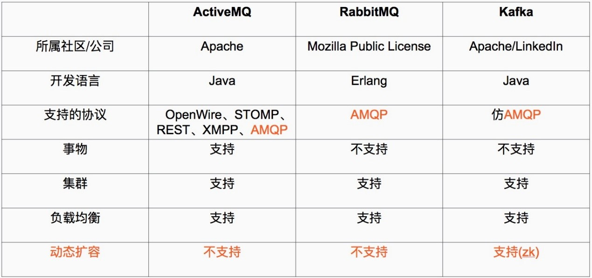
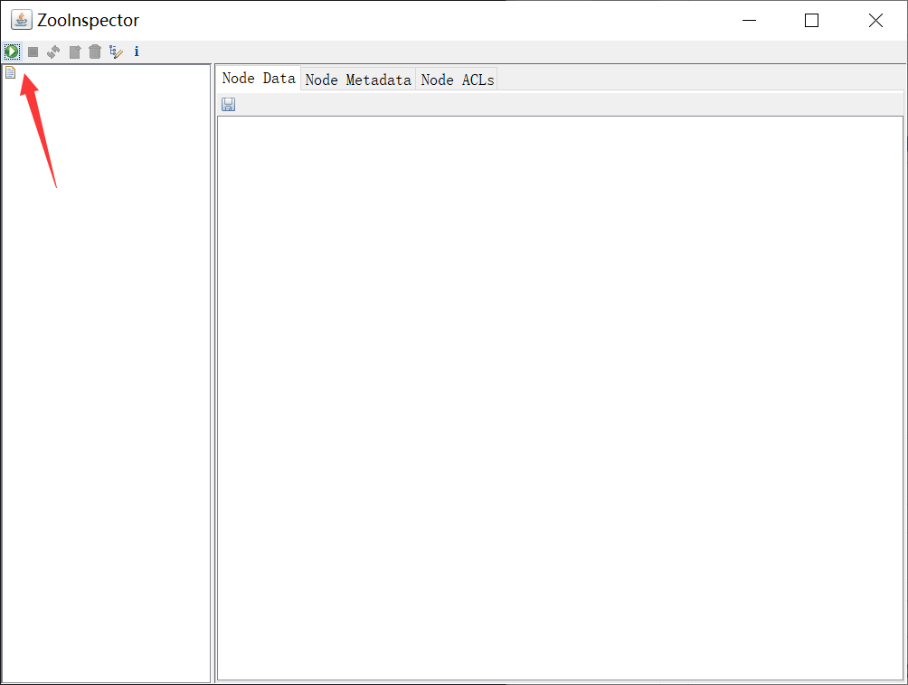
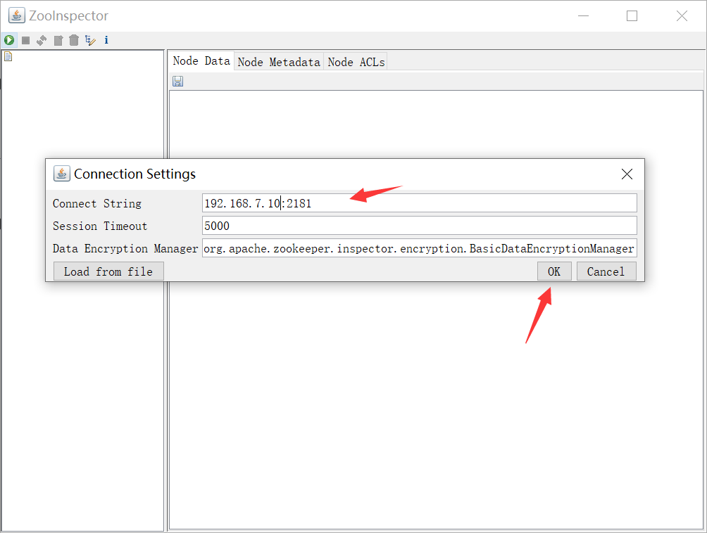
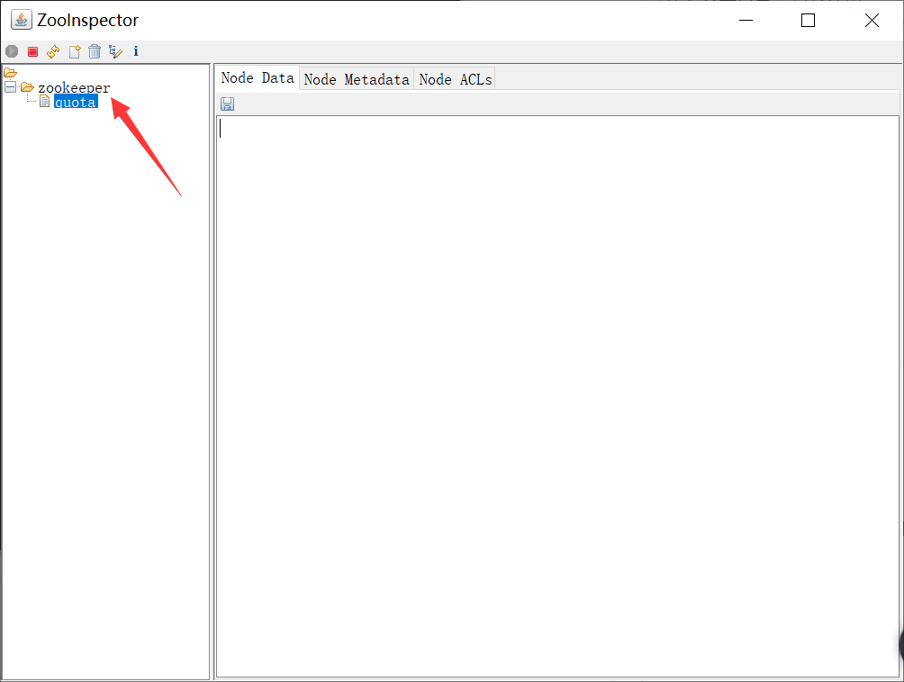
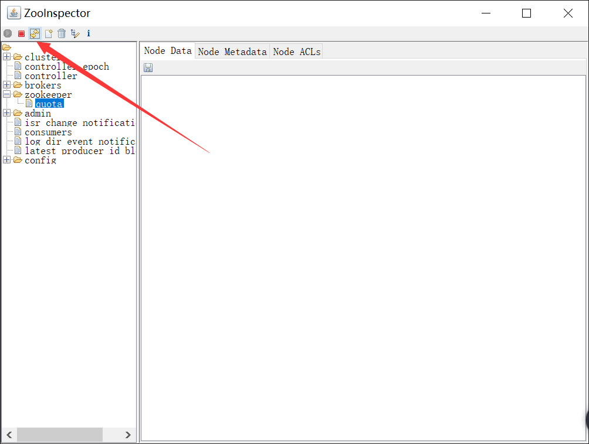
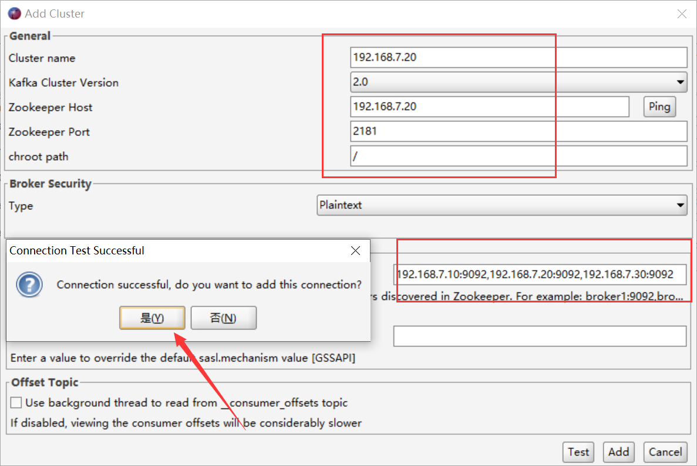
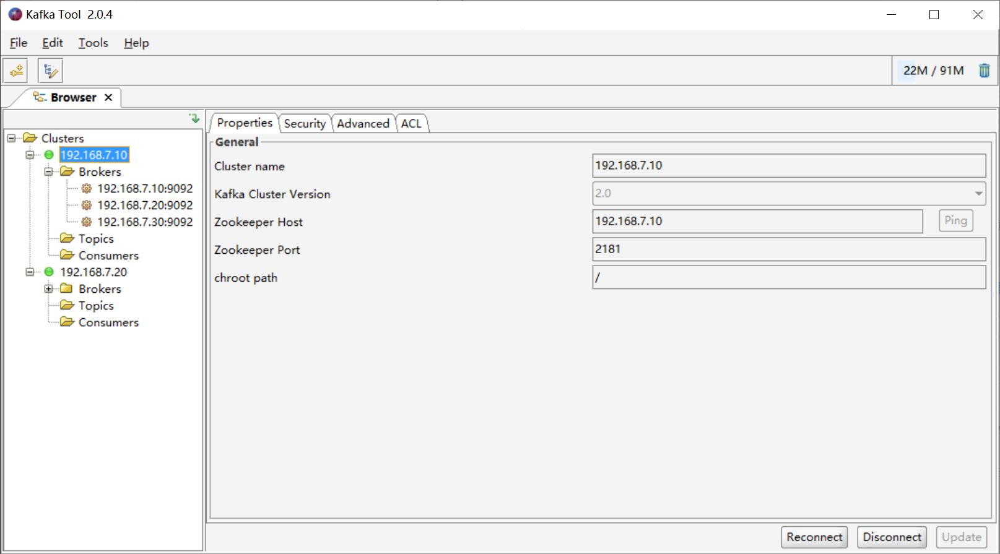

http://zookeeper.apache.org/
  ZooKeeper是一个分布式且开源的分布式应用程序协调服务。
  zookeeper集群特性：整个集群种只要有超过集群数量一半的zookeeper工作只正常的，那么整个集群对外就是可用的，
假如有2台服务器做了一个zookeeper集群，只要有任何一台故障或宕机，那么这个zookeeper集群就不可用了，因为剩下
的一台没有超过集群一半的数量，但是假如有三台zookeeper组成一个集群，那么损坏一台就还剩两台，大于3台的一半，
所以损坏一台还是可以正常运行的，但是再损坏一台就只剩一台集群就不可用了。那么要是4台组成一个zookeeper集群，
损坏一台集群肯定是正常的，那么损坏两台就还剩两台，那么2台不大于集群数量的一半，所以3台的zookeeper集群和4台
的zookeeper集群损坏两台的结果都是集群不可用，一次类推5台和6台以及7台和8台都是同理，所以这也就是为什么集群
一般都是奇数的原因。

http://kafka.apache.org/
  kafka被称为下一代分布式消息系统，是apache基金会一个开源项目，
  最主要的优势是其具备分布式功能、并且结合zookeeper可以实现动态扩容

<!--more-->



Broker
Kafka集群包含一个或多个服务器，这种服务器被称为broker
Topic 
每条发布到Kafka集群的消息都有一个类别，这个类别被称为topic。（物理上不同topic的消息分开存储，逻辑上一个topic的消息虽然保存于
一个或多个broker上但用户只需指定消息的topic即可生产或消费数据而不必关心数据存于何处）
Partition 
parition是物理上的概念，每个topic包含一个或多个partition，创建topic时可指定parition数量。每个partition对应于一个文件夹，该文
件夹下存储该partition的数据和索引文件
Producer 
负责发布消息到Kafka broker
Consumer 
消费消息。每个consumer属于一个特定的consuer group（可为每个consumer指定group name，若不指定group name则属于默认的group）。使
用consumer high level API时，同一topic的一条消息只能被同一个consumer group内的一个consumer消费，但多个consumer group可同时消
费这一消息。

=================================================================================================================

```sh
安装环境：
三台服务器
192.168.7.10
192.168.7.20
192.168.7.30

三台服务器上先配置好java环境
# cd /usr/local/src/
# tar xvf jdk-8u212-linux-x64.tar.gz

# ln -sv /usr/local/src/jdk1.8.0_212/ /usr/local/jdk
'/usr/local/jdk' -> '/usr/local/src/jdk1.8.0_212/'

# ln -sv /usr/local/jdk/bin/java /usr/bin/
'/usr/bin/java' -> '/usr/local/jdk/bin/java'

配置环境变量
# vim /etc/profile.d/jdk.sh
export HISTTIMEFORMAT="%F %t `whoami` "
export export LANG="en_US.utf-8"
export JAVA_HOME=/usr/local/jdk
export CLASSPATH=.:$JAVA_HOME/jre/lib/rt.jar:$JAVA_HOME/lib/dt.jar:$JAVA_HOME/lib/tools.jar
export PATH=$PATH:$JAVA_HOME/bin

# . /etc/profile.d/jdk.sh

验证版本
# java -version
java version "1.8.0_212"
Java(TM) SE Runtime Environment (build 1.8.0_212-b10)
Java HotSpot(TM) 64-Bit Server VM (build 25.212-b10, mixed mode)


1、三台服务器下载并安装zookeeper
# tar xvf zookeeper-3.4.14.tar.gz
# ln -sv /usr/local/src/zookeeper-3.4.14 /usr/local/zookeeper

# cd /usr/local/zookeeper
# cp conf/zoo_sample.cfg conf/zoo.cfg
#mkdir /usr/local/zookeeper/data          创建数据目录

# vim conf/zoo.cfg   三台服务器配置相同
# The number of milliseconds of each tick
tickTime=2000       #服务器与服务器之间和客户端与服务器之间的单次心跳检测时间间隔，单位为毫秒
# The number of ticks that the initial 
# synchronization phase can take
initLimit=10       #集群中leader服务器与follower服务器初始连接心跳次数，即多少个2000毫秒
# The number of ticks that can pass between 
# sending a request and getting an acknowledgement
syncLimit=5        # leader与follower之间连接完成之后，后期检测发送和应答的心跳次数，如果该follower 
                    在设置的时间内(5*2000)不能与leader 进行通信，那么此 follower 将被视为不可用
# the directory where the snapshot is stored.
# do not use /tmp for storage, /tmp here is just 
# example sakes.
dataDir=/usr/local/zookeeper/data        #自定义的zookeeper保存数据的目录
# the port at which the clients will connect
clientPort=2181       #客户端连接 Zookeeper 服务器的端口，Zookeeper 会监听这个端口，接受客户端的访问请求
# the maximum number of client connections.
# increase this if you need to handle more clients
maxClientCnxns=4096
#
# Be sure to read the maintenance section of the 
# administrator guide before turning on autopurge.
#
# http://zookeeper.apache.org/doc/current/zookeeperAdmin.html#sc_maintenance
#
# The number of snapshots to retain in dataDir
autopurge.snapRetainCount=512     #设置zookeeper保存保留多少次客户端连接的数据
# Purge task interval in hours
# Set to "0" to disable auto purge feature
autopurge.purgeInterval=1         #设置zookeeper间隔多少小时清理一次保存的客户端数据

server.1=192.168.7.10:2888:3888   #服务器编号=服务器IP:LF数据同步端口:LF选举端口
server.2=192.168.7.20:2888:3888
server.3=192.168.7.30:2888:3888


2、在三台服务器的数据目录中生成serverid
192.168.7.10：  # echo 1 > /usr/local/zookeeper/data/myid
192.168.7.20：  # echo 2 > /usr/local/zookeeper/data/myid
192.168.7.30：  # echo 3 > /usr/local/zookeeper/data/myid

3、启动zookeeper服务（三台服务器要同时启动，期间不要超过上面设置的20s）
# /usr/local/zookeeper/bin/zkServer.sh --help
# /usr/local/zookeeper/bin/zkServer.sh start
ZooKeeper JMX enabled by default
Using config: /usr/local/zookeeper/bin/../conf/zoo.cfg
Starting zookeeper ... STARTED

4、验证集群状态（2个follower、1个leader）
# /usr/local/zookeeper/bin/zkServer.sh status
ZooKeeper JMX enabled by default
Using config: /usr/local/zookeeper/bin/../conf/zoo.cfg
Mode: follower

# /usr/local/zookeeper/bin/zkServer.sh status
ZooKeeper JMX enabled by default
Using config: /usr/local/zookeeper/bin/../conf/zoo.cfg
Mode: follower

# /usr/local/zookeeper/bin/zkServer.sh status
ZooKeeper JMX enabled by default
Using config: /usr/local/zookeeper/bin/../conf/zoo.cfg
Mode: leader


5、测试数据（windows打开此工具，前提是windows安装配置好java环境 ）
```








```sh
6、下载并安装kafka
# cd /usr/local/src/
# tar xvf kafka_2.12-2.1.0.tgz

# ln -sv /usr/local/src/kafka_2.12-2.1.0 /usr/local/kafka
# cd /usr/local/kafka

server1
# vim config/server.properties
broker.id=1
listeners=PLAINTEXT://192.168.7.10:9092
log.dirs=/usr/local/kafka/kafka-logs
zookeeper.connect=192.168.7.10:2181,192.168.7.20:2181,192.168.7.30:2181

server2
# vim config/server.properties
broker.id=2
listeners=PLAINTEXT://192.168.7.20:9092
log.dirs=/usr/local/kafka/kafka-logs
zookeeper.connect=192.168.7.10:2181,192.168.7.20:2181,192.168.7.30:2181

server3
# vim config/server.properties
broker.id=3
listeners=PLAINTEXT://192.168.7.30:9092
log.dirs=/usr/local/kafka/kafka-logs
zookeeper.connect=192.168.7.10:2181,192.168.7.20:2181,192.168.7.30:2181

三台服务器分别以守护进程的方式启动kafka
/usr/local/kafka/bin/kafka-server-start.sh -daemon /usr/local/kafka/config/server.properties

查看server日志
# tail -f /usr/local/kafka/logs/server.log

7、刷新zookeeper，查看数据
```



```
8、测试kafka是否正常使用
windows客户端安装kafkatool_64bit.exe
连接
```





```sh
9、测试创建topic
# /usr/local/kafka/bin/kafka-topics.sh --create  --zookeeper 192.168.7.10:2181,192.168.7.20:2181,192.168.7.30:2181 --partitions 3 --replication-factor 3 --topic logstashtest
Created topic "logstashtest".

测试获取topic
# /usr/local/kafka/bin/kafka-topics.sh  --describe --zookeeper 192.168.7.10:2181,192.168.7.20:2181,192.168.7.30:2181  --topic logstashtest
Topic:logstashtest	PartitionCount:3	ReplicationFactor:3	Configs:
	Topic: logstashtest	Partition: 0	Leader: 2	Replicas: 2,1,3	Isr: 2,1,3
	Topic: logstashtest	Partition: 1	Leader: 3	Replicas: 3,2,1	Isr: 3,2,1
	Topic: logstashtest	Partition: 2	Leader: 1	Replicas: 1,3,2	Isr: 1,3,2

删除topic
# /usr/local/kafka/bin/kafka-topics.sh --delete  --zookeeper 192.168.7.10:2181,192.168.7.20:2181,192.168.7.30:2181 --topic logstashtest
Topic logstashtest is marked for deletion.
Note: This will have no impact if delete.topic.enable is not set to true.

验证是否被删除
# /usr/local/kafka/bin/kafka-topics.sh --describe  --zookeeper 192.168.7.10:2181,192.168.7.20:2181,192.168.7.30:2181 --topic logstashtest
```