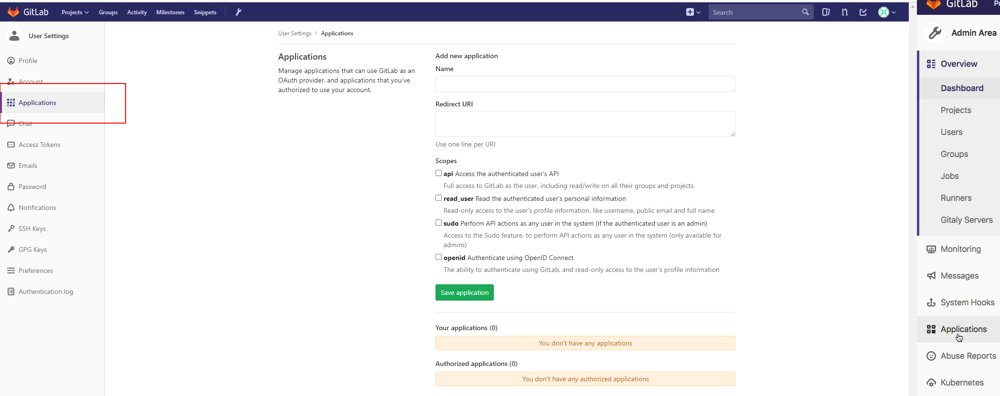
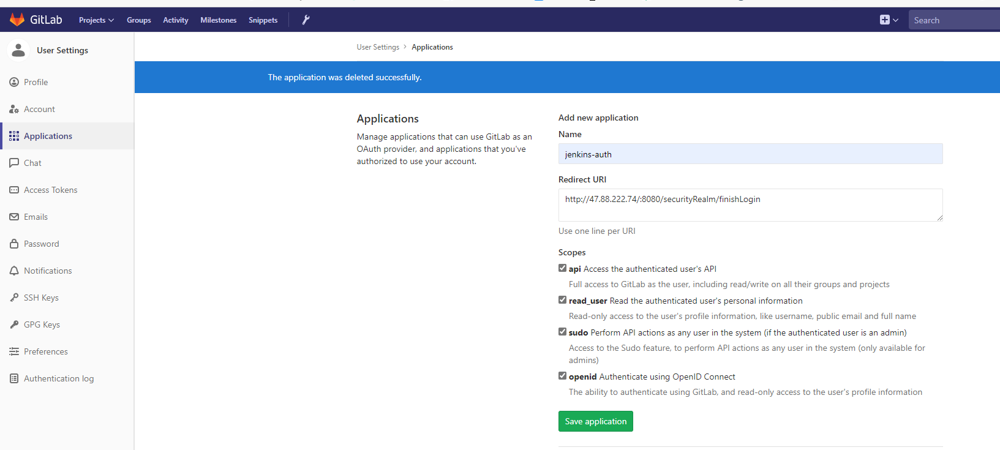
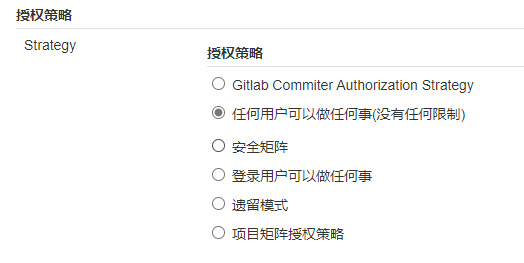
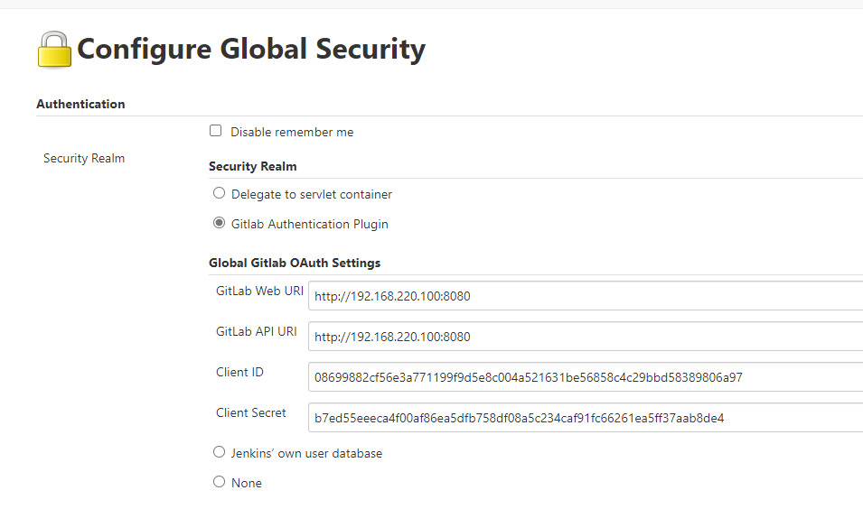

进入setting/application

<!--more-->

`http://192.168.220.104:8080/securityRealm/finishLogin`   换为jenkins地址

jenkins安装插件

先让用户可以做任何事

重新登录后即可使用gitlab用户认证

登录后权限认证可以改为Role-based

# 如果失败

更新 Jenkins 的 config.xml 文件，把 useSecurity 改为 false，重启 Jenkins 生效。Jenkins 就可以正常访问了。