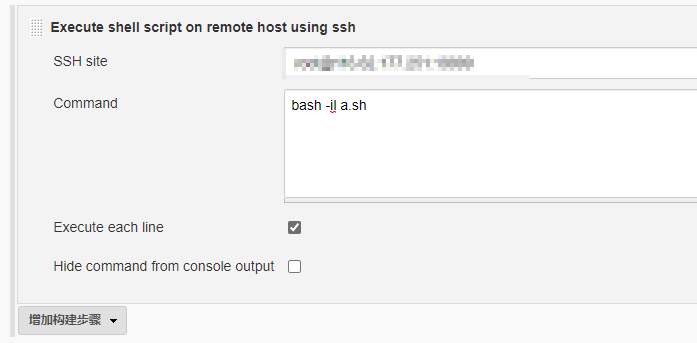
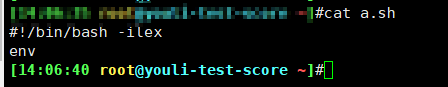
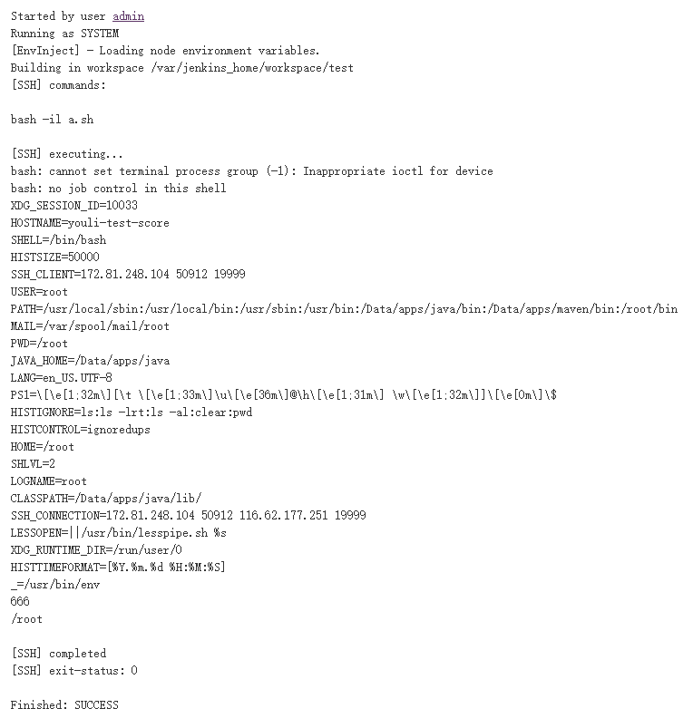
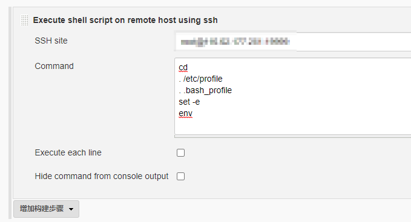
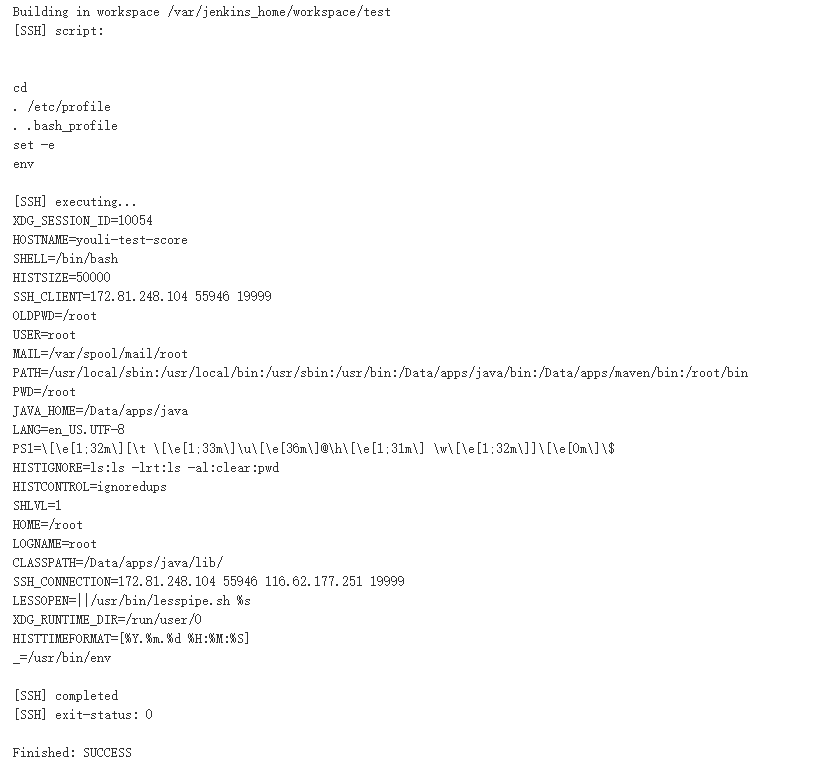

## 方法1：

在脚本中添加 `#!/bin/bash -ilex`

jenkins shell中使用 `bash -il  xxx.sh`

<!--more-->

`-i` 如果存在-i选项，则shell是交互式的
`-l` 使bash的行为就像它被作为登录shell调用一样
`-e` 每条指令之后后，都可以用#？去判断他的返回值，零就是正确执行，非零就是执行有误，加了-e之后，就不用自己写代码去判断返回值，返回非零，脚本就会退出。
`-x` 详细列出脚本运算过程

## 方法2

