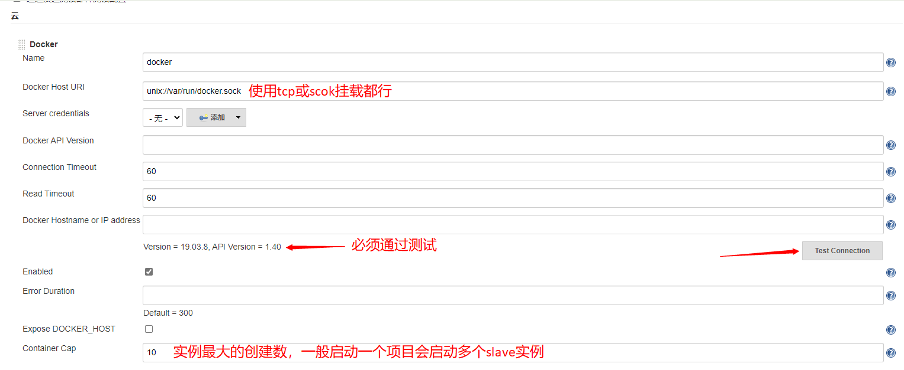
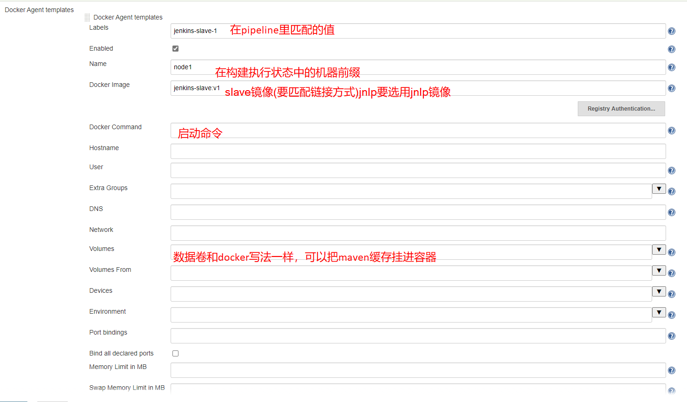
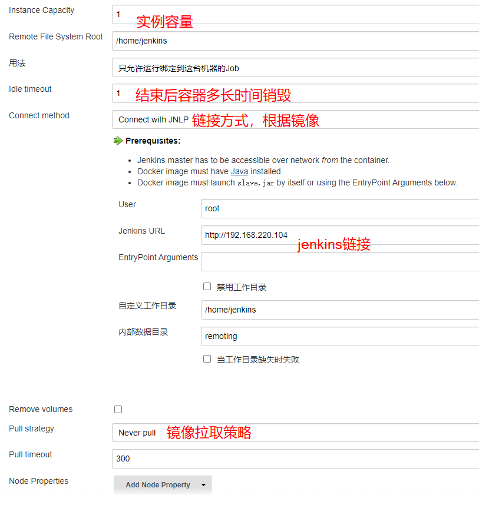

jenkins-docker 启动命令

```sh
docker run -d -u root --name jenkins \
-v /var/run/docker.sock:/var/run/docker.sock \
-v /usr/libexec/docker:/usr/libexec/docker \
-v /usr/bin/docker:/usr/bin/docker \
-v jenkins:/var/jenkins_home \
-p 80:8080 -p 50000:50000 \
jenkinszh/jenkins-zh:lts
```

<!--more-->







```groovy
pipeline {
    agent {
        label 'jenkins-slave-1'
    }
    
    stages {
        stage ('Exec Test Command') {
            steps{
                echo 'begin+++++++++++++++++++++'
                sh 'sleep 10s'
                sh 'whereis java'
                sh 'whoami'
                echo 'end+++++++++++++++++++++++'
            }
        }
    }
}

```

```groovy
import com.nirima.jenkins.plugins.docker.DockerCloud
import com.nirima.jenkins.plugins.docker.DockerTemplate
import com.nirima.jenkins.plugins.docker.DockerTemplateBase
import com.nirima.jenkins.plugins.docker.launcher.AttachedDockerComputerLauncher
import io.jenkins.docker.connector.DockerComputerAttachConnector
import jenkins.model.Jenkins

// parameters
def dockerTemplateBaseParameters = [
  bindAllPorts:       false,
  bindPorts:          '',
  cpuShares:          null,
  dnsString:          '',
  dockerCommand:      '',
  environmentsString: '',
  extraHostsString:   '',
  hostname:           '',
  image:              'jenkinsci/slave:latest',
  macAddress:         '',
  memoryLimit:        null,
  memorySwap:         null,
  network:            '',
  privileged:         false,
  pullCredentialsId:  '',
  sharedMemorySize:   null,
  tty:                true,
  volumesFromString:  '',
  volumesString:      ''
]

def DockerTemplateParameters = [
  instanceCapStr: '4',
  labelString:    'docker.local.jenkins.slave',
  remoteFs:       ''
]

def dockerCloudParameters = [
  connectTimeout:   3,
  containerCapStr:  '4',
  credentialsId:    '',
  dockerHostname:   '',
  name:             'docker.local',
  readTimeout:      60,
  serverUrl:        'unix:///var/run/docker.sock',
  version:          ''
]

// https://github.com/jenkinsci/docker-plugin/blob/docker-plugin-1.1.2/src/main/java/com/nirima/jenkins/plugins/docker/DockerTemplateBase.java
DockerTemplateBase dockerTemplateBase = new DockerTemplateBase(
  dockerTemplateBaseParameters.image,
  dockerTemplateBaseParameters.pullCredentialsId,
  dockerTemplateBaseParameters.dnsString,
  dockerTemplateBaseParameters.network,
  dockerTemplateBaseParameters.dockerCommand,
  dockerTemplateBaseParameters.volumesString,
  dockerTemplateBaseParameters.volumesFromString,
  dockerTemplateBaseParameters.environmentsString,
  dockerTemplateBaseParameters.hostname,
  dockerTemplateBaseParameters.memoryLimit,
  dockerTemplateBaseParameters.memorySwap,
  dockerTemplateBaseParameters.cpuShares,
  dockerTemplateBaseParameters.sharedMemorySize,
  dockerTemplateBaseParameters.bindPorts,
  dockerTemplateBaseParameters.bindAllPorts,
  dockerTemplateBaseParameters.privileged,
  dockerTemplateBaseParameters.tty,
  dockerTemplateBaseParameters.macAddress,
  dockerTemplateBaseParameters.extraHostsString
)

// https://github.com/jenkinsci/docker-plugin/blob/docker-plugin-1.1.2/src/main/java/com/nirima/jenkins/plugins/docker/DockerTemplate.java
DockerTemplate dockerTemplate = new DockerTemplate(
  dockerTemplateBase,
  new DockerComputerAttachConnector(),
  DockerTemplateParameters.labelString,
  DockerTemplateParameters.remoteFs,
  DockerTemplateParameters.instanceCapStr
)

// https://github.com/jenkinsci/docker-plugin/blob/docker-plugin-1.1.2/src/main/java/com/nirima/jenkins/plugins/docker/DockerCloud.java
DockerCloud dockerCloud = new DockerCloud(
  dockerCloudParameters.name,
  [dockerTemplate],
  dockerCloudParameters.serverUrl,
  dockerCloudParameters.containerCapStr,
  dockerCloudParameters.connectTimeout,
  dockerCloudParameters.readTimeout,
  dockerCloudParameters.credentialsId,
  dockerCloudParameters.version,
  dockerCloudParameters.dockerHostname
)

// get Jenkins instance
Jenkins jenkins = Jenkins.getInstance()

// add cloud configuration to Jenkins
jenkins.clouds.add(dockerCloud)

// save current Jenkins state to disk
jenkins.save()
```

