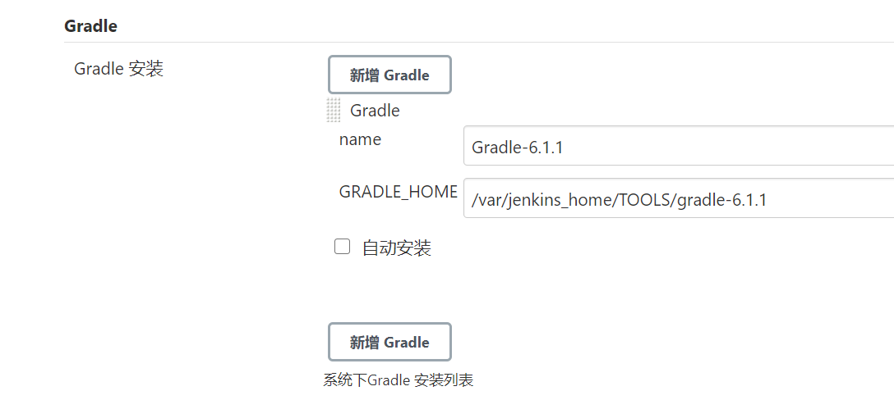

# 环境

- **java**
- **jdk**
- **Gradle**

安装jdk

```sh
wget http://dl.google.com/android/android-sdk_r24.4.1-linux.tgz
tar  -xf android-sdk_r24.4.1-linux.tgz
cd android-sdk-linux/
# 显示所有的sdk版本
./tools/android list sdk --all
# 然后选择想要更新的版本的编号:
./tools/android update sdk -u -a -t <package no.>
# 如:
./tools/android update sdk -u -a -t 1,2,3,4
```




<!--more-->

