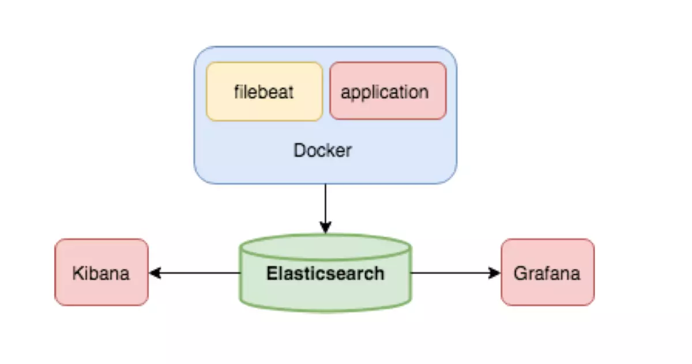
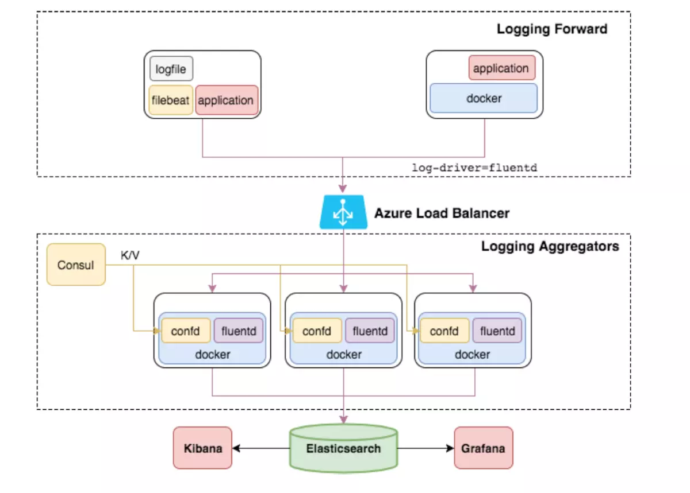
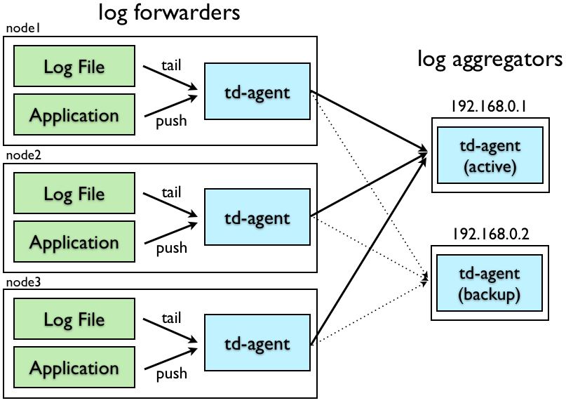

EFK由ElasticSearch、Fluentd和Kiabana三个开源工具组成。其中Elasticsearch是一款分布式搜索引擎，能够用于日志的检索，Fluentd是一个实时开源的数据收集器,而Kibana 是一款能够为Elasticsearch 提供分析和可视化的 Web 平台。这三款开源工具的组合为日志数据提供了分布式的实时搜集与分析的监控系统。

而在此之前，业界是采用ELK(Elasticsearch + Logstash + Kibana)来管理日志。Logstash是一个具有实时渠道能力的数据收集引擎,但和fluentd相比，它在效能上表现略逊一筹，故而逐渐被fluentd取代，ELK也随之变成EFK。

<!--more-->

### ELK架构

为了更好的了解EFK的架构，首先，我们先理解下ELK架构。在此之前，
 我们需要清楚如下几个概念：

- Log Source：日志来源。在微服务中，我们的日志主要来源于日志文件和Docker容器，日志文件包括服务器log，例如Nginx access log（记录了哪些用户，哪些页面以及用户浏览器、ip和其他的访问信息）, error log(记录服务器错误日志)等。
- Logstash：数据收集处理引擎，可用于传输docker各个容器中的日志给EK。支持动态的从各种数据源搜集数据，并对数据进行过滤、分析、丰富、统一格式等操作，然后存储以供后续使用。
- Filebeat：和Logstash一样属于日志收集处理工具，基于原先 Logstash-fowarder 的源码改造出来的。与Logstash相比，filebeat更加轻量，占用资源更少
- ElasticSearch:日志搜索引擎
- Kibana:用于日志展示的可视化工具
- Grafana:类似Kibana，可对后端的数据进行实时展示

下图是ELK架构，采用ElasticSearch、Kibana、Grafana、Filebeat来管理Docker容器日志。



由图可知，当我们在Docker中运行应用（application）时，filebeat收集容器中的日志。ElasticSearch收到日志对日志进行实时存储、搜索与分析。我们可在Kibana和Grafana这两个可视化工具中查看日志的操作结果。

### EFK架构

Fluentd是一个开源的数据收集器，专为处理数据流设计，使用JSON作为数据格式。它采用了插件式的架构，具有高可扩展性高可用性，同时还实现了高可靠的信息转发。

因此，我们加入Fluentd来收集日志。加入后的EFK架构如图所示。




# 架构选型

1. 存储层： Elasticsearch 是一个实时的、分布式的可扩展的搜索引擎，允许进行全文、结构化搜索，它通常用于索引和搜索大量日志数据，也可用于搜索许多不同类型的文档。
2. 展示层：Kibana   是 Elasticsearch 的一个功能强大的数据可视化 Dashboard，Kibana 允许你通过 web 界面来浏览 Elasticsearch 日志数据。
3. 缓存层：  需要收集大数据量的日志一般使用Redis、kafka做为中间缓存层来缓冲数据。
4. 采集层：

- Fluentd：是一个流行的开源数据收集器， 具有众多插件，通过获取容器日志文件、过滤和转换日志数据，然后将数据传递到 Elasticsearch 集群，在该集群中对其进行索引和存储。

- Fluentd-bit： 更适用于嵌入设备等资源受限的场景。占用系统资源较少，在插件可以满足需求的同时，无疑是更好的选择。另外Fluent Bit 提供了输出插件，可以把数据发给 Fluentd，因此他们可以在系统中作为独立服务互相协作。对比如下

  

  在这里插入图片描述

- Logstash：ES官方推荐，使用它有很多插件，灵活性很高，但由于是java语言编写，占用资源较高，一般作为过滤格式使用，当然也可以单独使用。

- Filebeat： ES官方新一代采集工具，是一个轻量级的日志传输工具，使用Golang语言编写，占用资源低，一般作为采集日志使用，当然也可以单独使用，同样它和Logstash可以互相协作。

详见：[详解日志采集工具--Logstash、Filebeat、Fluentd、Logagent对比](https://links.jianshu.com/go?to=https%3A%2F%2Fdeveloper.51cto.com%2Fart%2F201904%2F595529.htm)

相关架构图如下：


本文所使用架构
 Fluentd（采集），Elasticsearch （存储），kibana（展示）

# 安装

### 安装前配置

##### ntp时间同步(重要)

```
yum install ntp
vim /etc/ntp.conf  //添加要同步的时间服务器
/etc/init.d/ntpd start 
```

##### 文件打开数

查看当前设置

```
 ulimit -n
```

增加最大文件打开数，修改`/etc/security/limits.conf`

```
root soft nofile 65536
root hard nofile 65536
* soft nofile 65536
* hard nofile 65536
```

##### 修改`/etc/sysctl.conf`，添加如下内容

```
net.core.somaxconn = 1024
net.core.netdev_max_backlog = 5000
net.core.rmem_max = 16777216
net.core.wmem_max = 16777216
net.ipv4.tcp_wmem = 4096 12582912 16777216
net.ipv4.tcp_rmem = 4096 12582912 16777216
net.ipv4.tcp_max_syn_backlog = 8096
net.ipv4.tcp_slow_start_after_idle = 0
net.ipv4.tcp_tw_reuse = 1
net.ipv4.ip_local_port_range = 10240 65535
```

配置生效

```
sysctl -p 
```

```sh
yum安装

curl -L https://toolbelt.treasuredata.com/sh/install-redhat-td-agent3.sh | sh

命令

# 开始、停止、重启、查看状态
/etc/init.d/td-agent start
/etc/init.d/td-agent stop
/etc/init.d/td-agent restart
/etc/init.d/td-agent status
# 配置文件
/etc/td-agent/td-agent.conf
# 日志文件
/var/log/td-agent/td-agent.log
# 查询进程
ps -ef | grep td-agent
对应配置文件路径
| 项目                       路径   
| 主配置文件        /etc/td-agent/td-agent.conf  
| 主程序           /usr/sbin/td-agent  
| 程序日志         /var/log/td-agent/td-agent.log  
| ruby程序位置     /opt/td-agent/embedded/bin/ruby  
| pid位置         /var/run/td-atent/td-agent.pid 
查看默认主配置文件的配置
# egrep -v "^#|^$" /etc/td-agent/td-agent.conf
<match td.*.*>
  @type tdlog
  apikey YOUR_API_KEY
  auto_create_table
  buffer_type file
  buffer_path /var/log/td-agent/buffer/td
  <secondary>
    @type file
    path /var/log/td-agent/failed_records
  </secondary>
</match>
<match debug.**>
  @type stdout
</match>
<source>
  @type forward
</source>
<source>
  @type http
  port 8888
</source>
<source>
  @type debug_agent
  bind 127.0.0.1
  port 24230
</source>

默认配置下的监听状态

# netstat -utpln |grep ruby 
tcp        0      0 0.0.0.0:8888                0.0.0.0:*                   LISTEN      818/ruby            
tcp        0      0 0.0.0.0:24224               0.0.0.0:*                   LISTEN      823/ruby            
tcp        0      0 127.0.0.1:24230             0.0.0.0:*                   LISTEN      823/ruby            
udp        0      0 0.0.0.0:24224               0.0.0.0:*                               823/ruby
```


```
Ruby安装

卸载自带的ruby

yum remove ruby -y

安装ruby2.5

下载地址: http://www.ruby-lang.org/en/downloads/
tar zxvf ruby-2.5.1.tar.gz
mv ./ruby-2.5.1 /usr/local/ruby-2.5.1
cd /usr/local/ruby-2.5.1
./configure
make && make install
​```

gem换源

# 列出默认源
gem sources
# 移除默认源
gem sources --remove https://rubygems.org/
# 添加ruby-china源
gem sources -a https://gems.ruby-china.com/

安装编译环境和软件包依赖

yum install gcc gcc-c++ make automake autoconf libtool openssl-devel jemalloc-devel gmp-devel -y


安装fluentd

gem install fluentd --no-ri --no-rdoc
安装fluentd插件

# 查询插件
gem search fluent-plugin -rd # 列出github地址
# 安装mongo插件
gem install fluent-plugin-mongo --no-ri --no-rdoc


初始化fluentd

fluentd --setup /etc/fluentd

我没成功过     。。。。
```

# 测试

通过8888端口提交一条日志

```
 curl -X POST -d 'json={"json":"message"}' http://localhost:8888/debug.test
```

查看输出的日志

```
# tail -n 1 /var/log/td-agent/td-agent.log
2018-02-09 00:09:06.719633187 +0800 debug.test: {"json":"message"}
```

> 以上就是官方给出的最简化的demo，作用不大，但可以初步理解fluentd的工作方式

## CS结构



数据流的处理都是双向的，既有Input方向也有Output方向。
角色：

- 日志转发 //client承担此角色
- 日志聚合 //server扮演此角色

> `日志转发` 通常安装在每个节点上以接收本地日志，一旦接收到数据，通过网络将其转发到server端。
>
> `日志聚合` 接收转发而来的数据，缓冲，过滤并定期通过插件将数据上传到其他存储程序、本地文件等媒介中。

==client、server使用同一样部署方式，区别在于配置文件的不同。==

# 配置讲解

### `td-agent.conf`配置的组成部分

- `source` directives determine the input sources.
- `match` directives determine the output destinations.
- `filter` directives determine the event processing pipelines.
- `system` directives set system wide configuration.
- `label` directives group the output and filter for internal routing
- `@include` directives include other files.

```
source： 定义输入，数据的来源,input方向
match：定义输出，下一步的去向，如写入文件，或者发送到指定软件存储。output方向
filter：定义过滤，也即事件处理流水线，一般在输入和输出之间运行，可减少字段，也可丰富信息。
system：系统级别的设置，如日志级别、进程名称。
label：定义一组操作，从而实现复用和内部路由。
@include：引入其他文件，和Java、python的import类似。
//使用最多的就是source、match、filter
```

例如一个source部分：

##### 安装指定版本插件

```
td-agent-gem  install fluent-plugin-woothee --version=0.2.1
td-agent-gem  install woothee --version=1.4.0

//'fluent-plugin-woothee' is a Fluentd filter plugin to parse UserAgent strings and to filter/drop specified categories of user terminals (like 'pc', 'smartphone' and so on).
```

> yum安装的fluentd程序，`td-agent-gem`等价于`/opt/td-agent/embedded/bin/gem`

```sh
# 从 24224/tcp 接收数据
# This is used by log forwarding and the fluent-cat command
<source>
  @type forward
  port 24224
</source>

# 从9880/http协议接收数据
# http://this.host:9880/myapp.access?json={"event":"data"}
<source>
  @type http
  port 9880
</source>

//@type 是必须有的参数，指定类型就是指定使用的插件
//http：使 fluentd 转变为一个 httpd 端点，以接受进入的 http 报文。
//forward：使 fluentd 转变为一个 TCP 端点，以接受 TCP 报文。
```

## 插件介绍及安装

##### Fluentd有6种类型的插件(或者叫方法)，分别是：

```sh
Input输入：完成输入数据的读取，由source部分配置
//常用类型：tail、http、forward、tcp、udp、exec

Parser分析：解析插件，常与输入、输处配合使用，多见于`format`字段后面
//常用类型：ltsv、json、自定义等

Output输出：完成输出数据的操作，由match部分配置
//常用配置：file、forward、copy、stdout、exec

filter过滤：过滤插件
//常用配置：grep、ignore、record_transformer

Buffer缓存：缓存插件，用于缓存数据
//常用配置：file、mem

Formatter格式化：消息格式化的插件，用于输出，允许用户扩展和重新使用自定义输出格式
//常用类型：ltsv、json等
```

> **注意**：out_forward 转发输出插件将事件转发到其他fluentd节点。 此插件支持负载平衡和自动故障切换，由`<server></server>`标记。 对于复制，请使用 out_copy 插件，

copy 输出插件将事件复制到多个输出。由`<store></store>`标记

##### 安装一些需要的插件的命令

```sh
/opt/td-agent/embedded/bin/gem install woothee fluent-plugin-woothee  fluent-plugin-elasticsearch
```

##### 安装指定版本插件

```sh
td-agent-gem  install fluent-plugin-woothee --version=0.2.1
td-agent-gem  install woothee --version=1.4.0

//'fluent-plugin-woothee' is a Fluentd filter plugin to parse UserAgent strings and to filter/drop specified categories of user terminals (like 'pc', 'smartphone' and so on).
```

> yum安装的fluentd程序，`td-agent-gem`等价于`/opt/td-agent/embedded/bin/gem`

# 一些例子

## http输入，stdout输出

例子

```sh
<source>
    @type http
    port 8888
    bind 0.0.0.0
</source>

<match td3.**>
    type stdout
</match>
```

请求

```
curl http://127.0.0.1:8888/td3 -d 'json={"hi":"abc"}'
```

结果（/var/log/td-agent/td-agent.log）

```sh
tail -n1 /var/log/td-agent/td-agent.log
2020-06-04 22:13:52.811039879 +0800 td3: {"hi":"abc"}
```

格式：

```
<match td2.**>
    @type mongo
    host 10.218.139.216
    port 27017
    database db_log
    collection db_col
    time_format %H-%M-%S:%s  #时-分-秒.毫秒
    localtime                                  #本地时间
    flush_interval 10s
</match>
```

## http输入，文件输出

例子

```sh
mkdir /Data
chown td-agent:td-agent /Data -R
## Source descriptions
# HTTP input
# POST http://localhost:8888/<tag>?json=<json>
<source>
    @type http
    port 8888
    bind 0.0.0.0
</source>

## Output
# File output
# match tag=td.*.* and output to file
<match td.**>
    @type file
    path /Data/test.log
    flush_interval 10s
</match>

## match tag=td2.*.* and output to file
<match td2.**>
    @type file
    path /Data/test_2.log
    flush_interval 10s
</match>
```

http请求：

```
curl http://127.0.0.1:8888/td2 -d 'json={"hi":1}'
```

linux命令：

发POST请求工具：

结果查看：

```sh
cat test_2.log.20200604_0.log 
2020-06-04T22:27:10+08:00	td3	{"hi":1}
```

## http输入，mongoDB输出

例子

```
## Source descriptions
# HTTP input
# POST http://localhost:8888/<tag>?json=<json>
<source>
    @type http
    port 8888
    bind 0.0.0.0
</source>

## Output
# MongoDB output
# match tag=td2.*.* and output to file
<match td2.**>
    @type mongo
    host 10.218.139.216
    port 27017
    database db_log
    collection db_col
    time_key time
    flush_interval 10s
</match>
```

请求

```
curl 127.0.0.1:8888/td2 -d 'json={"hi":"123"}'
```

结果查询：

```
> show dbs
db_log  0.078GB
local   0.078GB

> use db_log
switched to db db_log

> show collections
db_col
system.indexes

> db.db_col.find()
{ "_id" : ObjectId("56af19dbdfb99f0f50000001"), "hi" : 2, "time" : ISODate("2016-02-01T08:39:47Z") }
```

## 文件输入，文件输出+json格式化

format部分可以位于<match>或<filter>部分中。

### 插件类型

format部分需要@type参数来指定格式化程序插件的类型。 fluentd内置了一些有用的格式化程序插件。安装第三方插件时也可以使用

```xml
<format>
  @type json
</format>
```

下面是一些内置的格式化插件：

- out_file
- json
- ltsv
- csv
- msgpack
- hash
- single_value

### 参数：

- @type：指定插件类型

### 时间参数

- time_type：时间类型
  - 默认值：float
  - 可选值：float, unixtime, string
    - float: 纪元+纳秒(例如:1510544836.154709804)
    - unixtime: 纪元(例如:1510544815)
    - string: 使用由`time_format`、本地时间或时区指定的格式
- time_format：时间格式
  - 默认值：nil
- localtime：如果为真，使用本地时间。否则，使用 UTC
  - 默认值：true
- utc：如果为真，使用UTC。否则，使用本地时间
  - 默认值：false
- timezone：指定时区
  - 默认值：nil
  - 可用的时区格式：
    1. [+-]HH:MM(例如:+09:00)
    2. [+-]HHMM(例如:+0900)
    3. [+-]HH(例如:+09)
    4. Region/Zone(例如:Asia/Tokyo)
    5. Region/Zone/Zone(例如:America/Argentina/Buenos_Aires)

### json插件举例：

json格式化插件将事件转换为json。默认情况下，json格式化程序结果不包含标签和时间字段。

可用参数：

- [通用参数](https://soulchild.cn/1717.html)
- [format参数](https://soulchild.cn/1752.html#)
- add_newline: 在结果中添加\n
  - 默认值：true

下面的配置是从/Data/test.log文件中读取内容，并写入文件

我们先来看一下不使用format的显示结果

```
<source>
    @type tail
    tag   test.aa
    path  /Data/test.log
    pos_file /Data/test.log.pos
    <parse **>
      @type none
    </parse>
</source>

<match test.aa>
  @type file
  path /Data/test-out.log
  flush_interval 10s
</match>

```

模拟生成日志：`echo 'test line 1' >> /Data/test.log`