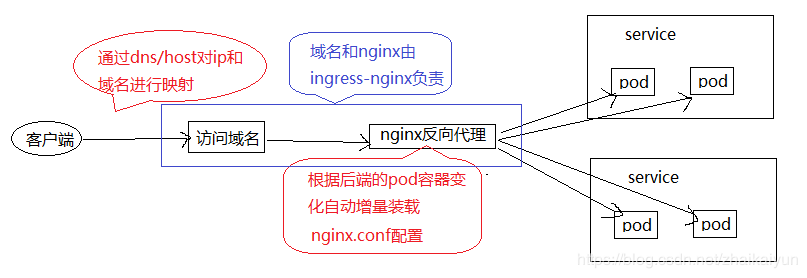

### 一、Ingress 简介



<!--more-->

```
在Kubernetes中，服务和Pod的IP地址仅可以在集群网络内部使用，对于集群外的应用是不可见的。为了使外部的应用能够访问集群内的服务，在Kubernetes 目前 提供了以下几种方案：
NodePort
LoadBalancer
Ingress
```

#### Ingress 组成

```
ingress controller
　　将新加入的Ingress转化成Nginx的配置文件并使之生效
ingress服务
　　将Nginx的配置抽象成一个Ingress对象，每添加一个新的服务只需写一个新的Ingress的yaml文件即可
```

#### Ingress 工作原理

```
1.ingress controller通过和kubernetes api交互，动态的去感知集群中ingress规则变化，
2.然后读取它，按照自定义的规则，规则就是写明了哪个域名对应哪个service，生成一段nginx配置，
3.再写到nginx-ingress-control的pod里，这个Ingress controller的pod里运行着一个Nginx服务，控制器会把生成的nginx配置写入/etc/nginx.conf文件中，
4.然后reload一下使配置生效。以此达到域名分配置和动态更新的问题。
```


#### Ingress 可以解决什么问题

```
1.动态配置服务
　　如果按照传统方式, 当新增加一个服务时, 我们可能需要在流量入口加一个反向代理指向我们新的k8s服务. 而如果用了Ingress, 只需要配置好这个服务, 当服务启动时, 会自动注册到Ingress的中, 不需要而外的操作.
2.减少不必要的端口暴露
　　配置过k8s的都清楚, 第一步是要关闭防火墙的, 主要原因是k8s的很多服务会以NodePort方式映射出去, 这样就相当于给宿主机打了很多孔, 既不安全也不优雅. 而Ingress可以避免这个问题, 除了Ingress自身服务可能需要映射出去, 其他服务都不要用NodePort方式
```

### 二、部署配置Ingress

#### 1 .部署文件介绍、准备

**获取配置文件位置: https://github.com/kubernetes/ingress-nginx/tree/nginx-0.20.0/deploy**

#### 下载部署文件

```
提供了两种方式 ：
　　默认下载最新的yaml：
　　　　wget  https://raw.githubusercontent.com/kubernetes/ingress-nginx/master/deploy/mandatory.yaml
　　指定版本号下载对应的yaml 
　　　　
```

#### 部署文件介绍

[](javascript:void(0);)

```
1.namespace.yaml 
创建一个独立的命名空间 ingress-nginx
2.configmap.yaml 
ConfigMap是存储通用的配置变量的，类似于配置文件，使用户可以将分布式系统中用于不同模块的环境变量统一到一个对象中管理；而它与配置文件的区别在于它是存在集群的“环境”中的，并且支持K8S集群中所有通用的操作调用方式。
从数据角度来看，ConfigMap的类型只是键值组，用于存储被Pod或者其他资源对象（如RC）访问的信息。这与secret的设计理念有异曲同工之妙，主要区别在于ConfigMap通常不用于存储敏感信息，而只存储简单的文本信息。
ConfigMap可以保存环境变量的属性，也可以保存配置文件。
创建pod时，对configmap进行绑定，pod内的应用可以直接引用ConfigMap的配置。相当于configmap为应用/运行环境封装配置。
pod使用ConfigMap，通常用于：设置环境变量的值、设置命令行参数、创建配置文件。

3.default-backend.yaml 
如果外界访问的域名不存在的话，则默认转发到default-http-backend这个Service，其会直接返回404：

4.rbac.yaml 
负责Ingress的RBAC授权的控制，其创建了Ingress用到的ServiceAccount、ClusterRole、Role、RoleBinding、ClusterRoleBinding

5.with-rbac.yaml 
是Ingress的核心，用于创建ingress-controller。前面提到过，ingress-controller的作用是将新加入的Ingress进行转化为Nginx的配置
```

#### 可将deployment改为daemonset并指定在master上运行

#### 一些配置文件

注解官方文档：https://github.com/kubernetes/ingress-nginx/blob/master/docs/user-guide/nginx-configuration/annotations.md

```yaml
apiVersion: extensions/v1beta1
kind: Ingress
metadata:
  name: test-cli
  annotations:
        nginx.ingress.kubernetes.io/rewrite-target: /$1
        nginx.ingress.kubernetes.io/affinity: "cookie"
        nginx.ingress.kubernetes.io/session-cookie-name: "route"
        nginx.ingress.kubernetes.io/session-cookie-expires: "172800"
        nginx.ingress.kubernetes.io/session-cookie-max-age: "172800"
        nginx.ingress.kubernetes.io/force-ssl-redirect: "false"
        nginx.ingress.kubernetes.io/ssl-redirect: "false"
        nginx.ingress.kubernetes.io/hsts: "false"
        nginx.ingress.kubernetes.io/server-snippet: |
            location / {
                internal;
                proxy_set_header X-Forwarded-Host $host;
                proxy_set_header X-Forwarded-Server $host;
                proxy_set_header X-Forwarded-For $proxy_add_x_forwarded_for;
                proxy_set_header X-Forwarded-Proto $scheme;
                proxy_set_header X-Real-IP $remote_addr;
                proxy_buffering off;
                proxy_pass http://##IP##:##PORT##/site/;
                proxy_redirect default;
                proxy_cookie_path /site/ /;
            }
spec:
  rules:
    - host: aaa.xxx.com
      http:
        paths:
        - path: /
          backend:
            serviceName: cliapi-prod
            servicePort: 8085
    - host: bbb.xxx.com
      http:
        paths:
        - path: /
          backend:
            serviceName: cliapi-prod
            servicePort: 8085

  tls:
    - hosts:
        - aaa.xxx.com
      secretName: 1
    - hosts:
      - bbb.xxx.com
      secretName: 1
```

