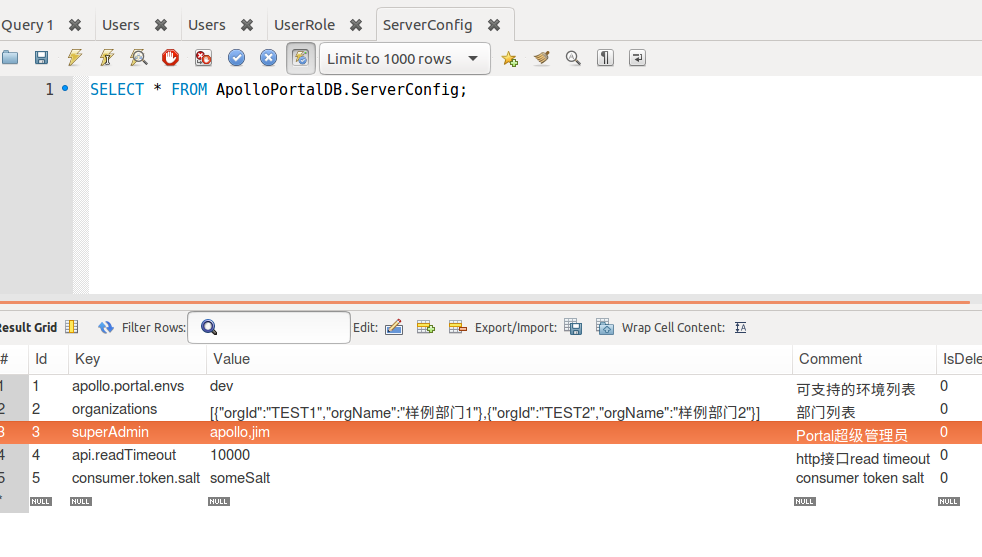

# **Apollo介绍**

Apollo（阿波罗）是携程框架部门研发的分布式配置中心，能够集中化管理应用不同环境、不同集群的配置，配置修改后能够实时推送到应用端，并且具备规范的权限、流程治理等特性，适用于微服务配置管理场景。

服务端基于Spring Boot和Spring Cloud开发，打包后可以直接运行，不需要额外安装Tomcat等应用容器。

Java客户端不依赖任何框架，能够运行于所有Java运行时环境，同时对Spring/Spring Boot环境也有较好的支持。

.Net客户端不依赖任何框架，能够运行于所有.Net运行时环境。

<!--more-->

## **Apollo特性**

- 统一管理不同环境、不同集群的配置
  - Apollo提供了一个统一界面集中式管理不同环境（environment）、不同集群（cluster）、不同命名空间（namespace）的配置。
  - 同一份代码部署在不同的集群，可以有不同的配置，比如zk的地址等
  - 通过命名空间（namespace）可以很方便的支持多个不同应用共享同一份配置，同时还允许应用对共享的配置进行覆盖
- 配置修改实时生效（热发布）
  - 用户在Apollo修改完配置并发布后，客户端能实时（1秒）接收到最新的配置，并通知到应用程序。
- 版本发布管理
  - 所有的配置发布都有版本概念，从而可以方便的支持配置的回滚。
- 灰度发布
  - 支持配置的灰度发布，比如点了发布后，只对部分应用实例生效，等观察一段时间没问题后再推给所有应用实例。
- 权限管理、发布审核、操作审计
  - 应用和配置的管理都有完善的权限管理机制，对配置的管理还分为了编辑和发布两个环节，从而减少人为的错误。
  - 所有的操作都有审计日志，可以方便的追踪问题。
- 客户端配置信息监控
  - 可以方便的看到配置在被哪些实例使用
- 提供Java和.Net原生客户端
  - 提供了Java和.Net的原生客户端，方便应用集成
  - 支持Spring Placeholder, Annotation和Spring Boot的ConfigurationProperties，方便应用使用（需要Spring 3.1.1+）
  - 同时提供了Http接口，非Java和.Net应用也可以方便的使用
- 提供开放平台API
  - Apollo自身提供了比较完善的统一配置管理界面，支持多环境、多数据中心配置管理、权限、流程治理等特性。
  - 不过Apollo出于通用性考虑，对配置的修改不会做过多限制，只要符合基本的格式就能够保存。
  - 在我们的调研中发现，对于有些使用方，它们的配置可能会有比较复杂的格式，如xml, json，需要对格式做校验。
  - 还有一些使用方如DAL，不仅有特定的格式，而且对输入的值也需要进行校验后方可保存，如检查数据库、用户名和密码是否匹配。
  - 对于这类应用，Apollo支持应用方通过开放接口在Apollo进行配置的修改和发布，并且具备完善的授权和权限控制
- 部署简单
  - 配置中心作为基础服务，可用性要求非常高，这就要求Apollo对外部依赖尽可能地少
  - 目前唯一的外部依赖是MySQL，所以部署非常简单，只要安装好Java和MySQL就可以让Apollo跑起来
  - Apollo还提供了打包脚本，一键就可以生成所有需要的安装包，并且支持自定义运行时参数

# 安装

## **拉取apollogit仓库**

https://github.com/ctripcorp/apollo

官方部署文档：https://github.com/ctripcorp/apollo/tree/master/scripts/apollo-on-kubernetes

## **初始化apollo数据库**

- 这次只安装prod环境

```sh
cd apollo-master/scripts/apollo-on-kubernetes/db
mysql -uroot -p123456 -h192.168.220.100 < config-db-prod/apolloconfigdb.sql
mysql -uroot -p123456 -h192.168.220.100 < portal-db/apolloportaldb.sql 
```

## **制作镜像**

https://github.com/ctripcorp/apollo/releases

```sh
wget https://github.com/ctripcorp/apollo/releases/download/v1.6.1/apollo-adminservice-1.6.1-github.zip
wget https://github.com/ctripcorp/apollo/releases/download/v1.6.1/apollo-configservice-1.6.1-github.zip
wget https://github.com/ctripcorp/apollo/releases/download/v1.6.1/apollo-portal-1.6.1-github.zip
```

## 解压压缩包, 获取程序 jar 包

```sh
tar xf apollo-adminservice-1.6.1-github.zip
tar xf apollo-configservice-1.6.1-github.zip
tar xf apollo-portal-1.6.1-github.zip
```

- 
  获取 apollo-portal-1.6.1.jar, 重命名为 apollo-portal.jar, 放到 scripts/apollo-on-kubernetes/apollo-portal-server

- 
  获取 apollo-adminservice-1.6.1.jar, 重命名为 apollo-adminservice.jar, 放到 scripts/apollo-on-kubernetes/apollo-admin-server

- 获取 apollo-configservice-1.6.1.jar, 重命名为 apollo-configservice.jar, 放到 scripts/apollo-on-kubernetes/apollo-config-server

```sh
docker  build -t  registry.cn-hangzhou.aliyuncs.com/xxx/apollo-portal-server:1.6.1 .
docker  build -t  registry.cn-hangzhou.aliyuncs.com/xxx/apollo-adminservice:1.6.1 .
docker  build -t  registry.cn-hangzhou.aliyuncs.com/xxx/apollo-configservice:1.6.1 .
docker build -t registry.cn-hangzhou.aliyuncs.com/xxx/alpine-bash-3.8:1.0 .
docker push xxx
```

## 修改yaml文件

- 按顺序修改部署

### apollo-config-server

- 更改数据库连接

- 添加jpa:直接部署会报错
- 更改镜像

> pod一直是running状态，对pod进行descirbe查看：
> kubectl describe pod/statefulset-apollo-config-server-dev-0  -n apollo-min 
> Readiness probe failed: dial tcp 10.244.0.74:8080: connect: connection refused
> 登入pod容器查看日志：
> kubectl exec -it statefulset-apollo-config-server-dev-0 -n apollo-min bash
> 日志默认路径在：/opt/logs/apollo-config-server
> 报错：
> 'hibernate.dialect' not set
> 解决方式：
> service-apollo-config-server-dev.yaml 中增加配置：
> spring.jpa.database-platform = org.hibernate.dialect.MySQL5Dialect

```yaml
data:
  application-github.properties: |
    spring.datasource.url = jdbc:mysql://192.168.220.100:3306/ProdApolloConfigDB?characterEncoding=utf8
    spring.datasource.username = root
    spring.datasource.password = 123456
    spring.jpa.database-platform = org.hibernate.dialect.MySQL5Dialect
```

- 部署

```sh
cd apollo-master/scripts/apollo-on-kubernetes/kubernetes/apollo-env-prod
kubectl apply -f service-apollo-config-server-prod.yaml

kubectl get pod -n sre -o wide
statefulset-apollo-config-server-prod-0                1/1     Running   0          179m   100.105.196.159   k8s-02   <none>           <none>
statefulset-apollo-config-server-prod-1                1/1     Running   0          178m   100.72.165.214    k8s-03   <none>           <none>
statefulset-apollo-config-server-prod-2                1/1     Running   0          178m   100.105.196.160   k8s-02   <none>           <none>
```

### apollo-admin-server

- 更改数据库连接

- 添加jpa:直接部署会报错
- 更改镜像
- 注释**initContainers**部分，部署时会init探测*apollo-config-server*是否可用，(我部署时已经起来了，但探测不成功)
- 部署

### apollo-portal-server

- 更改数据库连接

- 添加jpa:直接部署会报错
- 更改镜像
- Endpoints可以不用部署，直接注释掉,
- 部署

### 等待所有pod READY

```sh
$kubectl get pod -n sre
NAME                                                   READY   STATUS    RESTARTS   AGE
deployment-apollo-admin-server-prod-85495c665b-8jndt   1/1     Running   0          170m
deployment-apollo-admin-server-prod-85495c665b-jlgw9   1/1     Running   0          170m
deployment-apollo-admin-server-prod-85495c665b-nf9m6   1/1     Running   0          170m
deployment-apollo-portal-server-57648d478c-9wzr7       1/1     Running   0          150m
deployment-apollo-portal-server-57648d478c-hdsqq       1/1     Running   0          150m
deployment-apollo-portal-server-57648d478c-qvpt6       1/1     Running   0          150m
statefulset-apollo-config-server-prod-0                1/1     Running   0          3h11m
statefulset-apollo-config-server-prod-1                1/1     Running   0          3h10m
statefulset-apollo-config-server-prod-2                1/1     Running   0          3h10m
$kubectl get svc -n sre
NAME                                TYPE        CLUSTER-IP       EXTERNAL-IP   PORT(S)          AGE
service-apollo-admin-server-prod    NodePort    10.110.104.121   <none>        8090:31894/TCP   169m
service-apollo-config-server-prod   NodePort    10.104.36.228    <none>        8080:30005/TCP   3h10m
service-apollo-meta-server-prod     ClusterIP   None             <none>        8080/TCP         3h10m
service-apollo-portal-server        NodePort    10.99.224.188    <none>        8070:30001/TCP   149m
service-mysql-for-portal-server     ClusterIP   10.103.241.109   <none>        3306/TCP         149m
```

## 访问

http://192.168.220.100:30001/

- 访问时会自动跳转到登录页面，默认账号密码为apollo/admin

- 超级管理员只有apollo一个，如果想要增加多个超级管理员，则需要通过修改数据库实现，打开ApolloPortalDB.ServerConfig



- 在superAdmin对应的Value上以逗号隔开，增加用户名。

- 修改部门和增加部门，通过organizations的Value，不过这些部门和人员属于弱类型对应，所以可以随意修改。

- 其它配置项参考官方提供的文档说明：[https://github.com/ctripcorp/apollo/wiki/%E5%88%86%E5%B8%83%E5%BC%8F%E9%83%A8%E7%BD%B2%E6%8C%87%E5%8D%97#213-%E8%B0%83%E6%95%B4%E6%9C%8D%E5%8A%A1%E7%AB%AF%E9%85%8D%E7%BD%AE](https://github.com/ctripcorp/apollo/wiki/分布式部署指南#213-调整服务端配置)