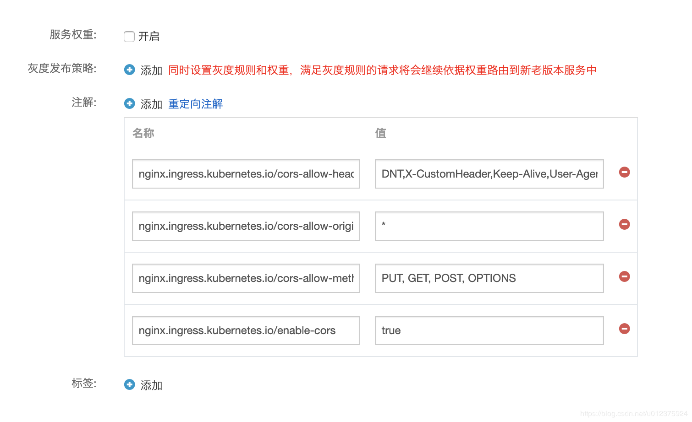

在Ingress中，跨域(CORS)的配置如下：

```yaml
nginx.ingress.kubernetes.io/cors-allow-headers: >-
      DNT,X-CustomHeader,Keep-Alive,User-Agent,X-Requested-With,If-Modified-Since,Cache-Control,Content-Type,Authorization
    nginx.ingress.kubernetes.io/cors-allow-methods: 'PUT, GET, POST, OPTIONS'
    nginx.ingress.kubernetes.io/cors-allow-origin: '*'
    nginx.ingress.kubernetes.io/enable-cors: 'true'
```

<!--more-->

将这个配置添加到Ingress的注解中即可，详见
https://kubernetes.github.io/ingress-nginx/user-guide/nginx-configuration/annotations/#enable-cors
以阿里云的k8s集群配置界面为例，在服务中添加如下配置：



目前在阿里云中使用k8s节点版(没master的托管集群)中，开启CORS配置时有个要主意的地方：
如果是单服务的话，不要开启服务权重，即不要这行配置：

```
nginx.ingress.kubernetes.io/service-weight: 'custom-hs: 100'
```

界面上不要点服务权重。
看一个完整的YAML文件：

```yaml
apiVersion: extensions/v1beta1
kind: Ingress
metadata:
  annotations:
    nginx.ingress.kubernetes.io/cors-allow-headers: >-
      DNT,X-CustomHeader,Keep-Alive,User-Agent,X-Requested-With,If-Modified-Since,Cache-Control,Content-Type,Authorization
    nginx.ingress.kubernetes.io/cors-allow-methods: 'PUT, GET, POST, OPTIONS'
    nginx.ingress.kubernetes.io/cors-allow-origin: '*'
    nginx.ingress.kubernetes.io/enable-cors: 'true'
    nginx.ingress.kubernetes.io/service-weight: ''
  creationTimestamp: '2019-06-27T12:36:08Z'
  generation: 1
  name: hs-http
  namespace: default
  resourceVersion: '81912785'
  selfLink: /apis/extensions/v1beta1/namespaces/default/ingresses/hs-http
  uid: 2343101d-98d8-11e9-8792-7a7bebcd6704
spec:
  rules:
    - host: hs.k8s.test.com
      http:
        paths:
          - backend:
              serviceName: custom-hs
              servicePort: 80
            path: /
  tls:
    - hosts:
        - hs.k8s.test.com
      secretName: hs-secret0
status:
  loadBalancer:
    ingress:
      - ip: //ip
```

