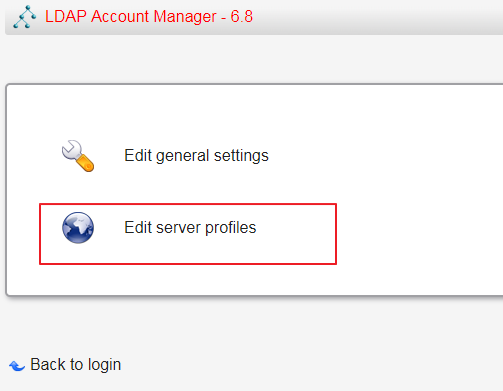

# docker中搭建

## 没用官方最新1.4.0镜像，在k8s中起不来，低版本可以1.2.xxx

```sh
docker run  \
-v /data/ldap/ldap:/var/lib/ldap \
-v /data/ldap/slapd.d:/etc/ldap/slapd.d \
--name ldap \
--env LDAP_TLS=false \
--env LDAP_ORGANISATION="flashwhale" \
--env LDAP_DOMAIN="flashwhale.com" \
--env LDAP_ADMIN_PASSWORD="djadmin" \
--env LDAP_CONFIG_PASSWORD="djadmin" \
-p 389:389 -p 636:636  \
--restart always \
--detach dinkel/openldap:2.4.40

#默认配置(不加变量)
dn          dc=example,dc=org
admin       admin,dc=example,dc=org
password    admin
```

<!--more-->

## 进入容器，验证一下是否可用

```sh
# 进入容器
docker exec -it ldap /bin/bash

# 执行查询
ldapsearch -x -H ldap://localhost:389 -b dc=flashwhale,dc=com -D "cn=admin,dc=flashwhale,dc=com" -w djadmin
```

## 新建LDAP用户

新建test11.ldif 写入以下内容

```sh
#cat test11.ldif 
dn: dc=flashwhale,dc=com
objectClass: top
objectClass: person
objectClass: posixAccount
objectClass: shadowAccount
uid: test11
cn: test11
sn: test11
uidNumber: 1034
gidNumber: 1003
loginShell: /bin/bash
homeDirectory: /home/test11/
```

创建ldap用户

```sh
ldapadd -x -D "cn=admin,dc=flashwhale,dc=com" -w djadmin  -f /root/test11.ldif 
```

注意：搭建ldapaccountmanager如果使用数据卷挂载要加环境变量，还要下载数据包Tar.bz2

https://www.ldap-account-manager.org/lamcms/releases

官方又给了两个配置文件存储地方：(我只加了var/lib/ldap-account-manager/config就好了)

- /etc/ldap-account-manager
- /var/lib/ldap-account-manager

```sh
docker run -d \
-p 80:80 \
--env LAM_SKIP_PRECONFIGURE=true \
--volume /data/lam/config:/var/lib/ldap-account-manager/config \
registry.cn-hangzhou.aliyuncs.com/xqbl-share/ldapaccountmanager:stable
```

设置





# k8s

```yaml
kind: Service
apiVersion: v1
metadata:
  name: ldap
  namespace: devops
  labels:
    app: ldap
spec:
  ports:
    - name: ldap
      port: 389
      targetPort: 389
  selector:
    app: ldap
---
apiVersion: apps/v1
kind: Deployment
metadata:
  name: ldap
  namespace: devops
spec:
  #serviceName: ldap
  selector:
    matchLabels:
      app: ldap
  template:
    metadata:
      labels:
        app: ldap
    spec:
      terminationGracePeriodSeconds: 10
      containers:
        - name: ldap
          image: dinkel/openldap:2.4.40
          imagePullPolicy: IfNotPresent
          ports:
            - containerPort: 389
              name: tcp-389
          volumeMounts:
            - name: ldapdata
              mountPath: /var/lib/ldap
            - name: ldapconf
              mountPath: /etc/ldap
          # resources:
          #   {}
          env:
            - name: SLAPD_PASSWORD
              value: "djadmin"
            - name: SLAPD_DOMAIN
              value: "ldap.flashwhale.com"

      volumes:
        - name: ldapdata
          persistentVolumeClaim:
            claimName: ldapdata
        - name: ldapconf
          persistentVolumeClaim:
            claimName: ldapconf
---
kind: PersistentVolumeClaim
apiVersion: v1
metadata:
  name: ldapdata
  namespace: devops
  annotations:
    volume.beta.kubernetes.io/storage-class: "alicloud-nas-fast"
spec:
  accessModes:
    - ReadWriteMany
  resources:
    requests:
      storage: 10Gi
---
kind: PersistentVolumeClaim
apiVersion: v1
metadata:
  name: ldapconf
  namespace: devops
  annotations:
    volume.beta.kubernetes.io/storage-class: "alicloud-nas-fast"
spec:
  accessModes:
    - ReadWriteMany
  resources:
    requests:
      storage: 10Gi

---
kind: Service
apiVersion: v1
metadata:
  name: ldapaccountmanager
  namespace: devops
  labels:
    app: ldapaccountmanager
spec:
  ports:
    - name: ldap
      protocol: TCP
      port: 80
      targetPort: 80
  selector:
    app: ldapaccountmanager
---
apiVersion: apps/v1
kind: Deployment
metadata:
  name: ldapaccountmanager
  namespace: devops
spec:
  selector:
    matchLabels:
      app: ldapaccountmanager
  template:
    metadata:
      labels:
        app: ldapaccountmanager
    spec:
      terminationGracePeriodSeconds: 10
      containers:
        - name: ldapaccountmanager
          image: ldapaccountmanager/lam:7.2
          imagePullPolicy: IfNotPresent
          ports:
            - containerPort: 80
              name: http
              protocol: TCP
          volumeMounts:
            - name: ldapaccountmanagerconf
              mountPath: /var/lib/ldap-account-manager/config
          resources:
            {}
          env:
            - name: LAM_SKIP_PRECONFIGURE
              value: "true"

      volumes:
        - name: ldapaccountmanagerconf
          persistentVolumeClaim:
            claimName: ldapaccountmanagerconf


---
kind: PersistentVolumeClaim
apiVersion: v1
metadata:
  name: ldapaccountmanagerconf
  namespace: devops
  annotations:
    volume.beta.kubernetes.io/storage-class: "alicloud-nas-fast"
spec:
  accessModes:
    - ReadWriteMany
  resources:
    requests:
      storage: 10Gi


```

