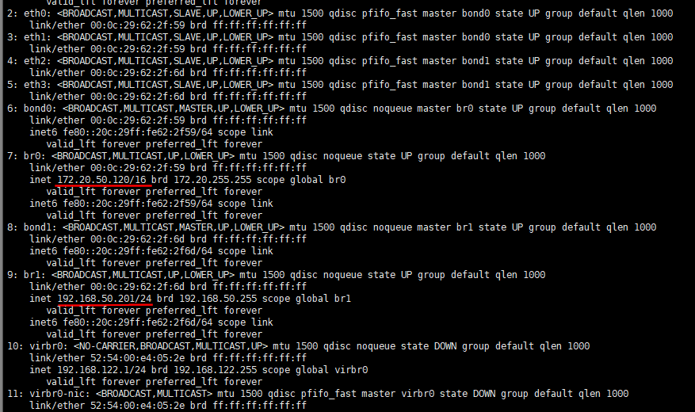
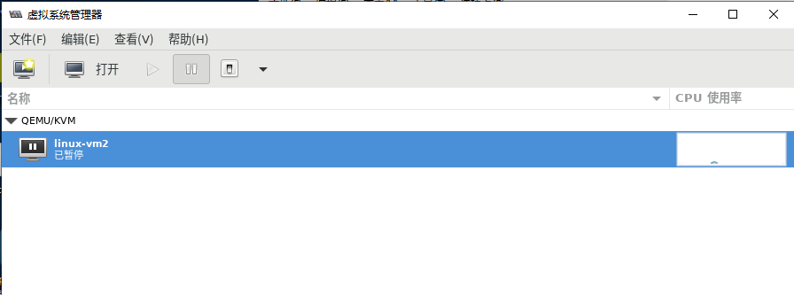

### 网卡配置

<!--more-->

```
[root@localhost /etc/sysconfig/network-scripts]#cat ifcfg-eth0
DEVICE="eth0"
ONBOOT=yes
NETBOOT=yes
BOOTPROTO=static
TYPE=Ethernet
#IPADDR=172.20.50.110
#NETMASK=255.255.0.0
#DNS1=172.20.0.1
MASTER=bond0
SLAVE=yes
USERCTL=no
NMCONTROLLED=no
[root@localhost /etc/sysconfig/network-scripts]#cat ifcfg-eth1
DEVICE="eth1"
ONBOOT=yes
NETBOOT=yes
BOOTPROTO=static
TYPE=Ethernet
#IPADDR=172.20.50.110
#NETMASK=255.255.0.0
#DNS1=172.20.0.1
MASTER=bond0
SLAVE=yes
USERCTL=no
NMCONTROLLED=no
[root@localhost /etc/sysconfig/network-scripts]#cat ifcfg-eth2
DEVICE="eth2"
ONBOOT=yes
NETBOOT=yes
BOOTPROTO=static
TYPE=Ethernet
#IPADDR=172.20.50.110
#NETMASK=255.255.0.0
#DNS1=172.20.0.1
MASTER=bond1
SLAVE=yes
USERCTL=no
NMCONTROLLED=no
[root@localhost /etc/sysconfig/network-scripts]#cat ifcfg-eth3
DEVICE="eth3"
ONBOOT=yes
NETBOOT=yes
BOOTPROTO=static
TYPE=Ethernet
#IPADDR=172.20.50.110
#NETMASK=255.255.0.0
#DNS1=172.20.0.1
MASTER=bond1
SLAVE=yes
USERCTL=no
NMCONTROLLED=no
[root@localhost /etc/sysconfig/network-scripts]#cat ifcfg-bond0
BOOTPROTO=static
NAME=bond0
DEVICE=bond0
ONBOOT=yes
BONDING_MASTER=yes
BONDING_OPTS="mode=1 miimon=100"
BRIDGE=br0
[root@localhost /etc/sysconfig/network-scripts]#cat ifcfg-bond1
BOOTPROTO=static
NAME=bond1
DEVICE=bond1
ONBOOT=yes
BONDING_MASTER=yes
BONDING_OPTS="mode=1 miimon=100"
BRIDGE=br1
[root@localhost /etc/sysconfig/network-scripts]#cat ifcfg-br0
TYPE=bridge
BOOTPROTO=static
DEVICE=br0
NAME=br0
ONBOOT=yes
IPADDR=172.20.50.110
PRFIX=16
GATEWAY=172.20.0.1
DNS1=114.114.114.114
[root@localhost /etc/sysconfig/network-scripts]#cat ifcfg-br1
TYPE=bridge
BOOTPROTO=static
NAME=br1
DEVICE=br1
ONBOOT=yes
IPADDR=192.168.50.200
PRFIX=24
#GATEWAY=192.168.1.1
#DNS1=114.114.114.114
```

 

 

做好网卡绑定



```
[root@localhost ~]#ip a
1: lo: <LOOPBACK,UP,LOWER_UP> mtu 65536 qdisc noqueue state UNKNOWN group default qlen 1000
    link/loopback 00:00:00:00:00:00 brd 00:00:00:00:00:00
    inet 127.0.0.1/8 scope host lo
       valid_lft forever preferred_lft forever
    inet6 ::1/128 scope host 
       valid_lft forever preferred_lft forever
2: eth0: <BROADCAST,MULTICAST,SLAVE,UP,LOWER_UP> mtu 1500 qdisc pfifo_fast master bond0 state UP group default qlen 1000
    link/ether 00:0c:29:62:2f:59 brd ff:ff:ff:ff:ff:ff
3: eth1: <BROADCAST,MULTICAST,SLAVE,UP,LOWER_UP> mtu 1500 qdisc pfifo_fast master bond0 state UP group default qlen 1000
    link/ether 00:0c:29:62:2f:59 brd ff:ff:ff:ff:ff:ff
4: eth2: <BROADCAST,MULTICAST,SLAVE,UP,LOWER_UP> mtu 1500 qdisc pfifo_fast master bond1 state UP group default qlen 1000
    link/ether 00:0c:29:62:2f:6d brd ff:ff:ff:ff:ff:ff
5: eth3: <BROADCAST,MULTICAST,SLAVE,UP,LOWER_UP> mtu 1500 qdisc pfifo_fast master bond1 state UP group default qlen 1000
    link/ether 00:0c:29:62:2f:6d brd ff:ff:ff:ff:ff:ff
6: bond0: <BROADCAST,MULTICAST,MASTER,UP,LOWER_UP> mtu 1500 qdisc noqueue master br0 state UP group default qlen 1000
    link/ether 00:0c:29:62:2f:59 brd ff:ff:ff:ff:ff:ff
    inet6 fe80::20c:29ff:fe62:2f59/64 scope link 
       valid_lft forever preferred_lft forever
7: br0: <BROADCAST,MULTICAST,UP,LOWER_UP> mtu 1500 qdisc noqueue state UP group default qlen 1000
    link/ether 00:0c:29:62:2f:59 brd ff:ff:ff:ff:ff:ff
    inet 172.20.50.120/16 brd 172.20.255.255 scope global br0
       valid_lft forever preferred_lft forever
    inet6 fe80::20c:29ff:fe62:2f59/64 scope link 
       valid_lft forever preferred_lft forever
8: bond1: <BROADCAST,MULTICAST,MASTER,UP,LOWER_UP> mtu 1500 qdisc noqueue master br1 state UP group default qlen 1000
    link/ether 00:0c:29:62:2f:6d brd ff:ff:ff:ff:ff:ff
    inet6 fe80::20c:29ff:fe62:2f6d/64 scope link 
       valid_lft forever preferred_lft forever
9: br1: <BROADCAST,MULTICAST,UP,LOWER_UP> mtu 1500 qdisc noqueue state UP group default qlen 1000
    link/ether 00:0c:29:62:2f:6d brd ff:ff:ff:ff:ff:ff
    inet 192.168.50.201/24 brd 192.168.50.255 scope global br1
       valid_lft forever preferred_lft forever
    inet6 fe80::20c:29ff:fe62:2f6d/64 scope link 
       valid_lft forever preferred_lft forever
10: virbr0: <NO-CARRIER,BROADCAST,MULTICAST,UP> mtu 1500 qdisc noqueue state DOWN group default qlen 1000
    link/ether 52:54:00:e4:05:2e brd ff:ff:ff:ff:ff:ff
    inet 192.168.122.1/24 brd 192.168.122.255 scope global virbr0
       valid_lft forever preferred_lft forever
11: virbr0-nic: <BROADCAST,MULTICAST> mtu 1500 qdisc pfifo_fast master virbr0 state DOWN group default qlen 1000
    link/ether 52:54:00:e4:05:2e brd ff:ff:ff:ff:ff:ff
```

在宿主2 创建虚拟机vm2 vm5

```
#创建vm2 vm5磁盘
[root@localhost ~]#qemu-img create -f qcow2 /var/lib/libvirt/images/vm5.qcow2 10G
Formatting '/var/lib/libvirt/images/vm5.quow2', fmt=qcow2 size=10737418240 encryption=off cluster_size=65536 lazy_refcounts=off 
[root@localhost ~]#qemu-img create -f qcow2 /var/lib/libvirt/images/vm2.qcow2 10G
Formatting '/var/lib/libvirt/images/vm2.quow2', fmt=qcow2 size=10737418240 encryption=off cluster_size=65536 lazy_refcounts=off
```

创建虚拟机 网卡设置为桥接的br0网卡

```
virt-install --virt-type kvm \
--name linux-vm2 \
--memory 1024 \
--vcpus 2 \
--cdrom=/usr/local/src/CentOS-7-x86_64-Minimal-1810.iso \
--disk path=/var/lib/libvirt/images/vm2.qcow2 \
--network bridge=br0 \
--graphics vnc,listen=0.0.0.0 \
--noautoconsole
```

运行图形管理器

```
yum install google-noto-sans-simplified-chinese-fonts.noarch
env LANG="zh_CN.UTF-8" virt-manager
```



```
#复制vm2硬盘到宿主1
scp vm2.qcow2 172.20.50.110:/var/lib/libvirt/images/vm1.qcow2
scp /usr/local/src/CentOS-7-x86_64-Minimal-1810.iso 172.20.50.110:/usr/local/src/CentOS-7-x86_64-Minimal-1810.iso
#在宿主1创建虚拟机vm1
virt-install --virt-type kvm \
--name linux-vm1 \
--memory 1024 \
--vcpus 2 \
--cdrom=/usr/local/src/CentOS-7-x86_64-Minimal-1810.iso \
--disk path=/var/lib/libvirt/images/vm1.qcow2 \
--network bridge=br0 \
--graphics vnc,listen=0.0.0.0 \
--noautoconsole
```

最后数量


vm1 vm2 有两块网卡，内网与外网，3，4只有一块

### 虚拟机管理命令：

```
[root@s1 src]# virsh list #列出当前开机的
[root@s1 src]# virsh list --all 3列出所有
[root@s1 src]# virsh shutdown CentOS-7-x86_64 #正常关机
[root@s1 src]# virsh start  CentOS-7-x86_64 #正常关机
[root@s1 src]# virsh destroy  centos7 #强制停止/关机
[root@s1 src]# virsh undefine Win_2008_r2-x86_64 #强制删除
[root@s1 src]# virsh autostart  centos7 #设置开机自启动
```