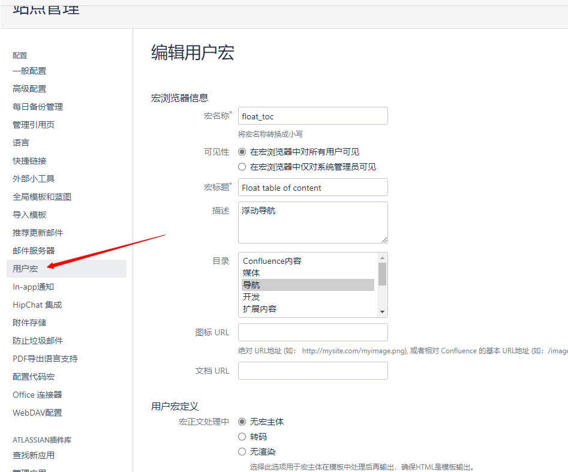
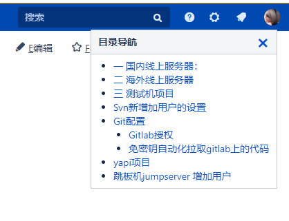

设置 > 一般配置 > 用户宏 > 创建用户宏

<!--more-->



在模板中添加以下代码：

```html
## Macro title: toc-right
## Macro has a body:  N
##
## Developed by: Benjamin DUPUIS
## Date created: 05/08/2011
## Date Updated: 30/11/2016
## Installed by: Benjamin DUPUIS
## @param Maxlvl:title=MaxLvl|type=int|required=true|desc=Max Level|default=5
## @param Float:title=Float|type=boolean|required=true|desc=Float/Fixed Position|default=true
## @param Hidable:title=Hidable|type=boolean|required=true|desc=Hidable (Float menu only)|default=true

#set($globalHelper=$action.getHelper())
#if ($content.id == $globalHelper.getPage().id)

#if (!$paramMaxlvl)
  #set ($paramMaxlvl=5)
#end

#set($mytoc=$globalHelper.renderConfluenceMacro("{toc:maxLevel=$paramMaxlvl}"))

#if ($paramFloat == true)
  #if ($paramHidable == true)
    <div id="show_customtoc" style="right:15px; top:100px; position:fixed; z-index:99; margin-left:8px; padding:10px; background:#ae0015; border-radius: 3px; writing-mode: vertical-lr; display: none">
      <a style="color:white; cursor:pointer" onclick="jQuery('#customtoc').toggle(true); jQuery('#show_customtoc').toggle(false)">Show Table Of Contents</a>
    </div>
  #end
<div id="customtoc" style="right:25px; top:100px; position:fixed; max-height: 80%; z-index:99; overflow: auto; margin-left:8px;background:white">
#else
  #if ($paramHidable == true)
    <div id="show_customtoc" style="float:right; margin-left:8px; padding:10px; background:#ae0015; border-radius: 3px; writing-mode: vertical-lr; display: none">
      <a style="color:white; cursor:pointer" onclick="jQuery('#customtoc').toggle(true); jQuery('#show_customtoc').toggle(false)">Show Table Of Contents</a>
    </div>
  #end
<div id="customtoc" style="float:right; margin-left:8px;background:white">
#end
  <table>
    <thead>
      <tr>
       <th>目录导航
#if ($paramHidable == true)
           <a style="margin: -5px; padding: 0; float: right; font-weight:bold; font-size:2em; line-height: 1em" onclick="jQuery('#customtoc').toggle(false); jQuery('#show_customtoc').toggle(true)">×</a>
#end
       </th>
      </tr>
    </thead>
    <tbody>
      <tr>
         <td>
           $mytoc
         </td>
      </tr>
    </tbody>
  </table>
</div>

#if ($paramHidable == true)
<script type="text/javascript">
     $(document).ready(function(){
        $("#customtoc a").click(function(event) {
          jQuery('#customtoc').toggle(false);
          jQuery('#show_customtoc').toggle(true);
        });
     });
#end
</script>
#end
```



