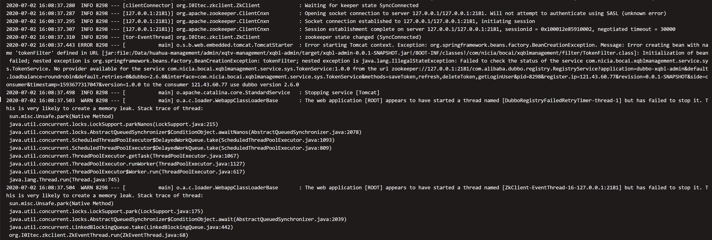

场景：

阿里云服务器，VPC网络，只开放常用端口

应用1：提供者

应用2：消费者

启动消费者没问题，dubbo-admin显示已经注册

提供者启动在注册zookeeper报错

dubbo-admin查看提供者注册的ip为外网，而外网端口并没有开放，所以消费者连接不到提供者

解决方法：

修改`/etc/hosts`将主机名解析到内网ip

`ip地址 主机名`

重启提供者，dubbo-admin显示已经注册内网ip，再启动消费者，无异常