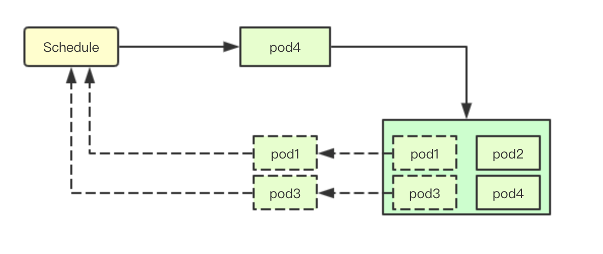
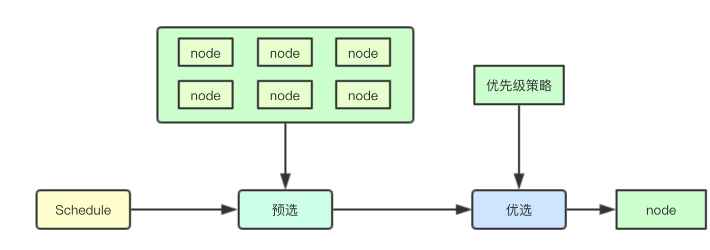
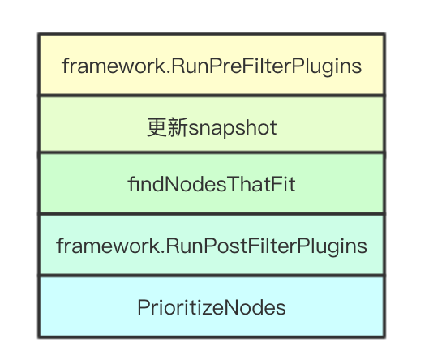
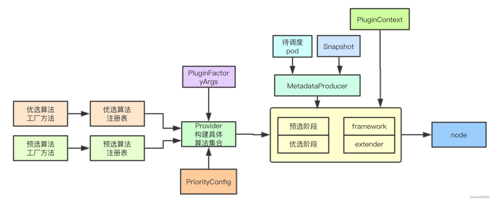

# ScheduleAlgorithm调度算法框架实现

ScheduleAlgorithm是一个接口负责为pod选择一个合适的node节点,本节主要解析如何实现一个可扩展、可配置的通用算法框架来实现通用调度

<!--more-->

# 1. 设计思考

## 1.1 调度设计

### 1.1.1 调度与抢占


当接收到pod需要被调度后，默认首先调用schedule来进行正常的业务调度尝试从当前集群中选择一个合适的node



如果调度失败则尝试抢占调度,根据优先级抢占低优先级的pod运行高优先级pod

<!--more-->

### 1.1.2 调度阶段



在k8s的调度算法运行流程中，主要分为两个阶段：预选和优选，即从当前集群中选择符合要求的node，再从这些node中选择最合适的节点


### 1.1.3 节点选择

随着集群的增加集群中的node数量越来越多，k8s并不是遍历所有集群资源，而是只选取部分节点，同时借助之前说的 schedulerCache来实现pod节点的分散


## 1.2 框架设计

### 1.2.1 注册表与算法工厂

针对不同的算法，声明不同的注册表，负责集群中当前所有算法的注册，从而提供给调度配置决策加载那些插件，实现算法的可扩展性


并通过工厂模式来进行统一管理，解耦算法的注册与具体调度流程中的使用，由每个算法的工厂方法来接受参数进行具体算法的创建


### 1.2.3 metadata与PluginContext


在调度实际运行的过程中，需要集合当前集群中的元数据信息(node和pod)来进行具体算法的决策，scheduler采用PredicateMetadataProducer和PriorityMetadataProducer来进行元数据的构建, 其次针对一些可能被多个算法都使用的数据，也会在这里完成构建，比如亲和性的pod、拓扑等


并通过PluginContext进行本次调度上下文数据的存储，用于在多个调度算法之间存储数据进行交互


### 1.2.4  Provider

Provider主要是封装一组具体的预选和优选算法，并通过注册来实现统一管理, 其中系统内置了DefaultProvider


### 1.2.5 framework

framework是一种内部的扩展机制，通过定制给定的阶段函数，进行调度流程的影响，本节先不介绍


### 1.2.6 extender

一种外部的扩展机制，可以根据需要进行动态的配置，其实就是外部的一个service，但是相比framework可以使用自己独立的数据存储，实现对调度器的扩展


# 2. 源码分析


## 2.1 数据结构

```
type genericScheduler struct {
    cache                    internalcache.Cache
    schedulingQueue          internalqueue.SchedulingQueue
    predicates               map[string]predicates.FitPredicate
    priorityMetaProducer     priorities.PriorityMetadataProducer
    predicateMetaProducer    predicates.PredicateMetadataProducer
    prioritizers             []priorities.PriorityConfig
    framework                framework.Framework
    extenders                []algorithm.SchedulerExtender
    alwaysCheckAllPredicates bool
    nodeInfoSnapshot         *schedulernodeinfo.Snapshot
    volumeBinder             *volumebinder.VolumeBinder
    pvcLister                corelisters.PersistentVolumeClaimLister
    pdbLister                algorithm.PDBLister
    disablePreemption        bool
    percentageOfNodesToScore int32
    enableNonPreempting      bool
}
```

### 2.1.1 集群数据

集群元数据主要分为三部分:

Cache: 存储从apiserver获取的数据 

SchedulingQueue: 存储当前队列中等待调度和经过调度但是未真正运行的pod

```
    cache                    internalcache.Cache
    schedulingQueue          internalqueue.SchedulingQueue
    nodeInfoSnapshot         *schedulernodeinfo.Snapshot
```


### 2.1.1 预选算法相关

预选算法主要包含两部分：当前使用的预选调度算法结合和元数据构建器

```
    predicates               map[string]predicates.FitPredicate
    predicateMetaProducer    predicates.PredicateMetadataProducer
```


### 2.1.3 优先级算法相关

优选算法与预选算法不太相同，在后续文章中会进行介绍

```
    priorityMetaProducer     priorities.PriorityMetadataProducer
    prioritizers             []priorities.PriorityConfig
```


### 2.1.4 扩展相关

```
    framework                framework.Framework
    extenders                []algorithm.SchedulerExtender
```


## 2.2 调度算法注册表


Priority会复杂一点,这里就不介绍了，其核心设计都是一样的

### 2.2.1 工厂注册表

```
fitPredicateMap        = make(map[string]FitPredicateFactory)
```

### 2.2.2 注册表注册

注册主要分两类：如果后续算法不会使用当前Args里面的数据，只需要使用metadata里面的，就直接返回注册算法，下面的函数就是返回一个工厂方法，但是不会使用Args参数

```
func RegisterFitPredicate(name string, predicate predicates.FitPredicate) string {
    return RegisterFitPredicateFactory(name, func(PluginFactoryArgs) predicates.FitPredicate { return predicate })
}
```

最终注册都是通过下面的工厂注册函数实现，通过mutex和map实现

```
func RegisterFitPredicateFactory(name string, predicateFactory FitPredicateFactory) string {
    schedulerFactoryMutex.Lock()
    defer schedulerFactoryMutex.Unlock()
    validateAlgorithmNameOrDie(name)
    fitPredicateMap[name] = predicateFactory
    return name
}
```

### 2.2.3 生成预选算法

通过插件工厂参数影响和Factory构建具体的预选算法，上面构建的工厂方法，下面则给定参数，通过工厂方法利用闭包的方式来进行真正算法的生成

```
func getFitPredicateFunctions(names sets.String, args PluginFactoryArgs) (map[string]predicates.FitPredicate, error) {
    schedulerFactoryMutex.RLock()
    defer schedulerFactoryMutex.RUnlock()

    fitPredicates := map[string]predicates.FitPredicate{}
    for _, name := range names.List() {
        factory, ok := fitPredicateMap[name]
        if !ok {
            return nil, fmt.Errorf("invalid predicate name %q specified - no corresponding function found", name)
        }
        fitPredicates[name] = factory(args)
    }

    // k8s中默认包含一些强制性的策略，不允许用户自己进行删除，这里是加载这些参数
    for name := range mandatoryFitPredicates {
        if factory, found := fitPredicateMap[name]; found {
            fitPredicates[name] = factory(args)
        }
    }

    return fitPredicates, nil
}
```


### 2.2.4 根据当前feature进行算法删除

当我们在系统演进的时候，也可以借鉴这种思想，来避免用户使用那些当前或者未来版本中可能逐渐被放弃的设计

```
if utilfeature.DefaultFeatureGate.Enabled(features.TaintNodesByCondition) {
        // Remove "CheckNodeCondition", "CheckNodeMemoryPressure", "CheckNodePIDPressure"
        // and "CheckNodeDiskPressure" predicates
        factory.RemoveFitPredicate(predicates.CheckNodeConditionPred)
        factory.RemoveFitPredicate(predicates.CheckNodeMemoryPressurePred)
    }
```


## 2.3 predicateMetadataProducer


### 2.3.1 PredicateMetadata

```
// PredicateMetadata interface represents anything that can access a predicate metadata.
type PredicateMetadata interface {
    ShallowCopy() PredicateMetadata
    AddPod(addedPod *v1.Pod, nodeInfo *schedulernodeinfo.NodeInfo) error
    RemovePod(deletedPod *v1.Pod, node *v1.Node) error
}
```


### 2.3.2 声明

```
predicateMetadataProducer PredicateMetadataProducerFactory
```

工厂函数

```
// PredicateMetadataProducerFactory produces PredicateMetadataProducer from the given args.
type PredicateMetadataProducerFactory func(PluginFactoryArgs) predicates.PredicateMetadataProducer
```

PredicateMetadataProducer通过上面的工厂函数创建而来，其接受当前需要调度的pod和snapshot里面的node信息，从而构建当前的PredicateMetadata

```
// PredicateMetadataProducer is a function that computes predicate metadata for a given pod.
type PredicateMetadataProducer func(pod *v1.Pod, nodeNameToInfo map[string]*schedulernodeinfo.NodeInfo) PredicateMetadata
```


### 2.3.2 注册

```
// RegisterPredicateMetadataProducerFactory registers a PredicateMetadataProducerFactory.
func RegisterPredicateMetadataProducerFactory(factory PredicateMetadataProducerFactory) {
    schedulerFactoryMutex.Lock()
    defer schedulerFactoryMutex.Unlock()
    predicateMetadataProducer = factory
}
```

### 2.3.4 意义

PredicateMetadata其本质上就是当前系统中的元数据，其设计的主要目标是为了当前的调度流程中后续多个调度算法中都可能需要计算的数据，进行统一的计算，比如节点的亲和性、反亲和、拓扑分布等，都在此进行统一的控制， 当前版本的实现时PredicateMetadataFactory,这里不进行展开


## 2.4 Provider

### 2.4.1 AlgorithmProviderConfig

```
// AlgorithmProviderConfig is used to store the configuration of algorithm providers.
type AlgorithmProviderConfig struct {
    FitPredicateKeys     sets.String
    PriorityFunctionKeys sets.String
}
```

### 2.4.2 注册中心

```
algorithmProviderMap   = make(map[string]AlgorithmProviderConfig)
```


### 2.4.3 注册

```
func RegisterAlgorithmProvider(name string, predicateKeys, priorityKeys sets.String) string {
    schedulerFactoryMutex.Lock()
    defer schedulerFactoryMutex.Unlock()
    validateAlgorithmNameOrDie(name)
    algorithmProviderMap[name] = AlgorithmProviderConfig{
        FitPredicateKeys:     predicateKeys,
        PriorityFunctionKeys: priorityKeys,
    }
    return name
}
```


### 2.4.4 默认Provider注册

```
func init() {
    // 注册算法DefaulrProvider 的算法provider
    registerAlgorithmProvider(defaultPredicates(), defaultPriorities())
}
```

 

## 2.5 核心调度流程



核心调度流程，这里面只介绍主线的流程，至于怎么预选和优选则在下一篇文章进行更新，因为稍微有点复杂，而framework和extender则在后续介绍完这两部分在进行介绍, 其中extender的调用则是在PrioritizeNodes进行优先级算中进行调用

```
// Schedule tries to schedule the given pod to one of the nodes in the node list.
// If it succeeds, it will return the name of the node.
// If it fails, it will return a FitError error with reasons.
func (g *genericScheduler) Schedule(pod *v1.Pod, pluginContext *framework.PluginContext) (result ScheduleResult, err error) {
    // 省略非核心代码
    // 调用framework的RunPreFilterPlugins
    preFilterStatus := g.framework.RunPreFilterPlugins(pluginContext, pod)
    if !preFilterStatus.IsSuccess() {
        return result, preFilterStatus.AsError()
    }

    // 获取当前的node数量
    numNodes := g.cache.NodeTree().NumNodes()
    if numNodes == 0 {
        return result, ErrNoNodesAvailable
    }

    // 更新snapshot
    if err := g.snapshot(); err != nil {
        return result, err
    }
    // 预选阶段
    filteredNodes, failedPredicateMap, filteredNodesStatuses, err := g.findNodesThatFit(pluginContext, pod)
    if err != nil {
        return result, err
    }

    // 将预选结果调用framework的postfilter
    postfilterStatus := g.framework.RunPostFilterPlugins(pluginContext, pod, filteredNodes, filteredNodesStatuses)
    if !postfilterStatus.IsSuccess() {
        return result, postfilterStatus.AsError()
    }

    if len(filteredNodes) == 0 {
        return result, &FitError{
            Pod:                   pod,
            NumAllNodes:           numNodes,e
            FailedPredicates:      failedPredicateMap,
            FilteredNodesStatuses: filteredNodesStatuses,
        }
    }

    startPriorityEvalTime := time.Now()
    // 如果只有一个节点则直接返回
    if len(filteredNodes) == 1 {
        return ScheduleResult{
            SuggestedHost:  filteredNodes[0].Name,
            EvaluatedNodes: 1 + len(failedPredicateMap),
            FeasibleNodes:  1,
        }, nil
    }

    // 获取所有的调度策略
    metaPrioritiesInterface := g.priorityMetaProducer(pod, g.nodeInfoSnapshot.NodeInfoMap)
    // 获取所有node的优先级,此处会将extenders进行传入，实现扩展接口的调用
    priorityList, err := PrioritizeNodes(pod, g.nodeInfoSnapshot.NodeInfoMap, metaPrioritiesInterface, g.prioritizers, filteredNodes, g.extenders, g.framework, pluginContext)
    if err != nil {
        return result, err
    }
    // 从优先级中选择出合适的node
    host, err := g.selectHost(priorityList)
    trace.Step("Selecting host done")
    return ScheduleResult{
        SuggestedHost:  host,
        EvaluatedNodes: len(filteredNodes) + len(failedPredicateMap),
        FeasibleNodes:  len(filteredNodes),
    }, err
}
```


# 3. 设计总结



在调度算法框架中大量使用了工厂方法来进行算法、元数据等的构建,并通过封装MetadataProducer来进行公共业务逻辑接口的封装，通过PluginContext进行调度流程中上下文数据的传递，并且用户可以通过定制Provider来进行具体调度算法的选择