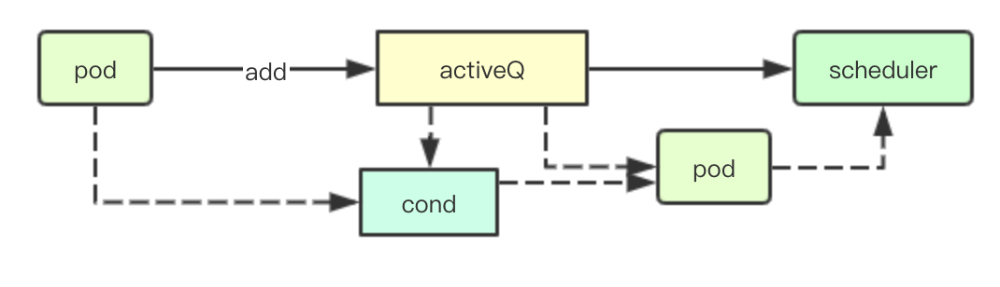
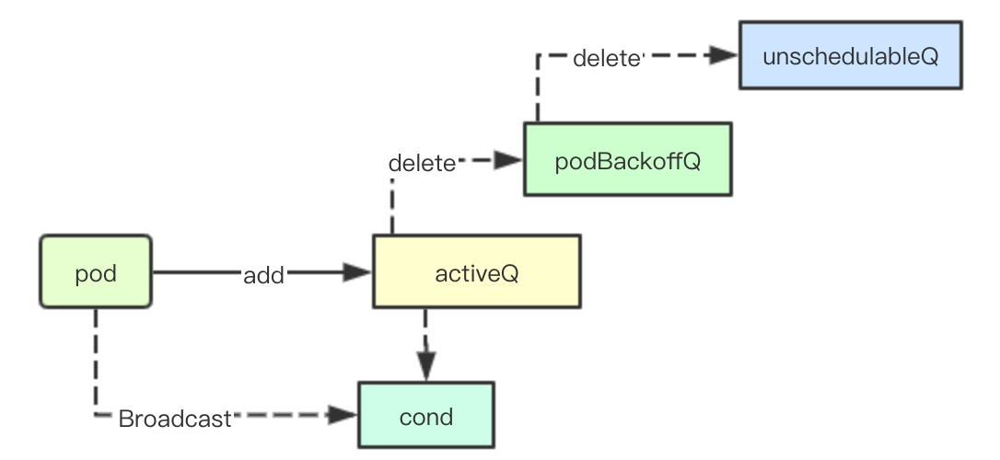
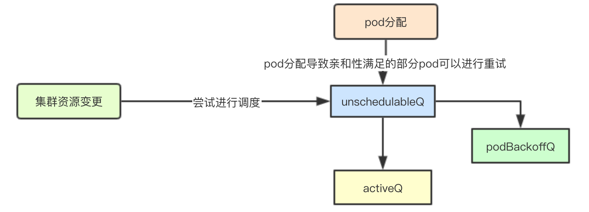
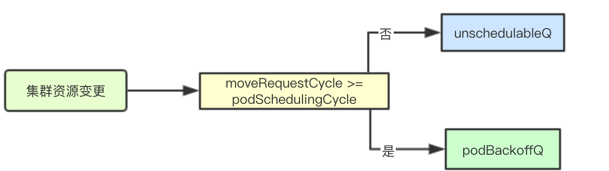
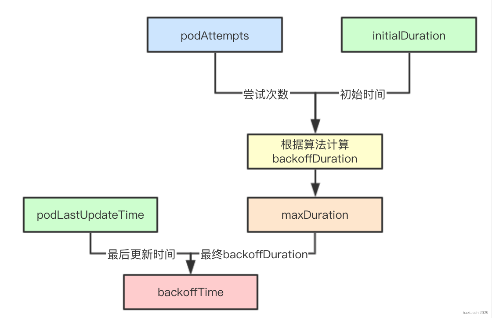
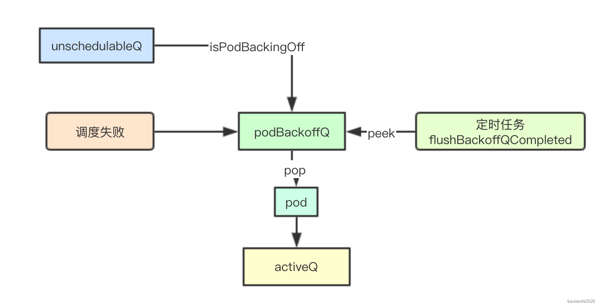
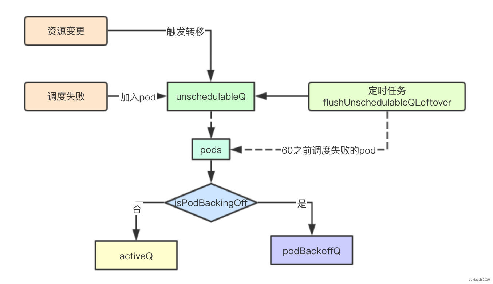
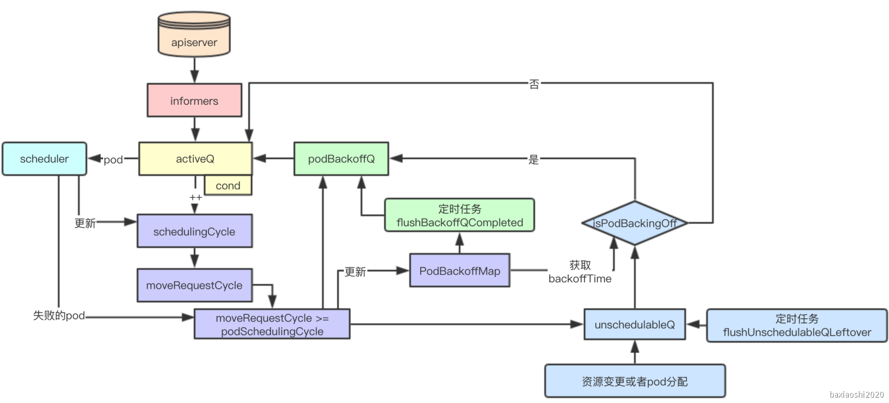

# SchedulingQueue三级调度队列实现

SchedulingQueue是kubenrets scheduler中负责进行等待调度pod存储的对，Scheduler通过SchedulingQueue来获取当前系统中等待调度的Pod，本文主要讨论SchedulingQueue的设计与实现的各种实现, 了解探究其内部实现与底层源码,本系列代码基于kubernets1.1.6分析而来

<!--more-->

# 1. SchedulingQueue设计

## 1.1 队列与优先级

### 1.1.1 队列与场景

| 类型       | 描述                                                       | 通常实现     |
| ---------- | ---------------------------------------------------------- | ------------ |
| 队列       | 普通队列是一个FIFO的数据结构，根据元素入队的次序依次出队   | 数组或者链表 |
| 优先级队列 | 优先级队列通常是指根据某些优先级策略，高优先级会优先被获取 | 数组或者树   |

其实在大多数的调度场景中，大多都是采用优先级队列来实现，优先满足优先级比较高的任务或者需求，从而减少后续高优先级对低优先级的抢占，scheduler中也是如此 


### 1.1.2 优先级的选择

k8s中调度的单元是Pod，scheduler中根据pod的优先级的高低来进行优先级队列的构建, 这个其实是在kubernets的adminission准入插件中，会为用户创建的pod根据用户的设置，进行优先级字段的计算


## 1.2 三级队列

### 1.2.1 活动队列

活动队列存储当前系统中所有正在等待调度的队列


### 1.2.2 不可调度队列

当pod的资源在当前集群中不能被满足时，则会被加入到一个不可调度队列中，然后等待稍后再进行尝试


### 1.2.3 backoff队列

backoff机制是并发编程中常见的一种机制，即如果任务反复执行依旧失败，则会按次增长等待调度时间，降低重试效率，从而避免反复失败浪费调度资源


针对调度失败的pod会优先存储在backoff队列中，等待后续重试


## 1.3 阻塞与抢占

### 1.3.1 阻塞设计

当队列中不存在等待调度的pod的时候，会阻塞scheduler等待有需要调度的pod的时候再唤醒调度器，获取pod进行调度

### 1.3.2 抢占相关

nominatedPods存储pod被提议运行的node,主要用于抢占调度流程中使用，本节先不分析


# 2. 源码分析

## 2.1 数据结构

kubernetes中默认的schedulingQueue实现是PriorityQueue，本章就以该数据结构来分析

```
type PriorityQueue struct {
    stop  <-chan struct{}
    clock util.Clock
    // 存储backoff的pod计时器
    podBackoff *PodBackoffMap

    lock sync.RWMutex
    // 用于协调通知因为获取不到调度pod而阻塞的cond
    cond sync.Cond

    // 活动队列
    activeQ *util.Heap
    
    // backoff队列
    podBackoffQ *util.Heap
    
    // 不可调度队列
    unschedulableQ *UnschedulablePodsMap
    // 存储pod和被提名的node, 实际上就是存储pod和建议的node节点
    nominatedPods *nominatedPodMap
    // schedulingCycle是一个调度周期的递增序号，当pod pop的时候会递增
    schedulingCycle int64
    // moveRequestCycle缓存schedulingCycle, 当未调度的pod重新被添加到activeQueue中
    // 会保存schedulingCycle到moveRequestCycle中
    moveRequestCycle int64
    closed bool
}
```

PriorityQueue作为实现SchedulingQueue的实现，其核心数据结构主要包含三个队列:activeQ、podBackoffQ、unscheduleQ内部通过cond来实现Pop操作的阻塞与通知，接下来先分析核心的调度流程，最后再分析util.Heap里面的具体实现

### 2.1.1 activeQ

存储所有等待调度的Pod的队列，默认是基于堆来实现，其中元素的优先级则通过对比pod的创建时间和pod的优先级来进行排序

```
    // activeQ is heap structure that scheduler actively looks at to find pods to
    // schedule. Head of heap is the highest priority pod.
    activeQ *util.Heap
```

优先级比较函数

```
// activeQComp is the function used by the activeQ heap algorithm to sort pods.
// It sorts pods based on their priority. When priorities are equal, it uses
// PodInfo.timestamp.
func activeQComp(podInfo1, podInfo2 interface{}) bool {
    pInfo1 := podInfo1.(*framework.PodInfo)
    pInfo2 := podInfo2.(*framework.PodInfo)
    prio1 := util.GetPodPriority(pInfo1.Pod)
    prio2 := util.GetPodPriority(pInfo2.Pod)
    // 首先根据优先级的高低进行比较，然后根据pod的创建时间，越高优先级的Pod越被优先调度
    // 越早创建的pod越优先
    return (prio1 > prio2) || (prio1 == prio2 && pInfo1.Timestamp.Before(pInfo2.Timestamp))
}
```


### 2.1.2 podbackOffQ

podBackOffQ主要存储那些在多个schedulingCycle中依旧调度失败的情况下，则会通过之前说的backOff机制，延迟等待调度的时间

```
    // podBackoffQ is a heap ordered by backoff expiry. Pods which have completed backoff
    // are popped from this heap before the scheduler looks at activeQ
    podBackoffQ *util.Heap
```


### 2.1.3 podBackOff

上面提到podBackOffQ队列中并没有存储pod的backOff的具体信息，比如backoff的计数器，最后一次更新的时间等，podBackOff则类似一个记分板，记录这些信息，供podBackOffQ使用

```
    // podBackoff tracks backoff for pods attempting to be rescheduled
    podBackoff *PodBackoffMap

// PodBackoffMap is a structure that stores backoff related information for pods
type PodBackoffMap struct {
    // lock for performing actions on this PodBackoffMap
    lock sync.RWMutex
    // initial backoff duration
    initialDuration time.Duration // 当前值是1秒
    // maximal backoff duration
    maxDuration time.Duration // 当前值是1分钟
    // map for pod -> number of attempts for this pod
    podAttempts map[ktypes.NamespacedName]int
    // map for pod -> lastUpdateTime pod of this pod
    podLastUpdateTime map[ktypes.NamespacedName]time.Time
}
```


### 2.1.4 unschedulableQ

存储已经尝试调度但是当前集群资源不满足的pod的队列

### 2.1.5 moveRequestCycle

当因为集群资源发生变化会尝试进行unschedulableQ中的pod转移到activeQ,moveRequestCycle就是存储资源变更时的schedulingCycle

```
func (p *PriorityQueue) MoveAllToActiveQueue() {
    // 省略其他代码
    p.moveRequestCycle = p.schedulingCycle
}
```


### 2.1.6 schedulingCycle

schedulingCycle是一个递增的序列每次从activeQ中pop出一个pod都会递增

```
func (p *PriorityQueue) Pop() (*v1.Pod, error) {
    //省略其他
        p.schedulingCycle++
}
```

## 2.2 并发活动队列

### 2.2.1 并发从活动队列中获取pod



SchedulingQueue提供了一个Pop接口用于从获取当前集群中等待调度的pod,其内部实现主要通过上面cond与activeQ来实现


当前队列中没有可调度的pod的时候，则通过cond.Wait来进行阻塞，然后在忘activeQ中添加pod的时候通过cond.Broadcast来实现通知

```
func (p *PriorityQueue) Pop() (*v1.Pod, error) {
    p.lock.Lock()
    defer p.lock.Unlock()
    for p.activeQ.Len() == 0 {
        if p.closed {
            return nil, fmt.Errorf(queueClosed)
        }
        // 
        p.cond.Wait()
    }
    obj, err := p.activeQ.Pop()
    if err != nil {
        return nil, err
    }
    pInfo := obj.(*framework.PodInfo)
    p.schedulingCycle++
    return pInfo.Pod, err
}
```


### 2.2.2 加入调度pod到活动队列



当pod加入活动队列中，除了加入activeQ的优先级队列中，还需要从podBackoffQ和unschedulableQ中移除当前的pod,最后进行广播通知阻塞在Pop操作的scheudler进行最新pod的获取

```
func (p *PriorityQueue) Add(pod *v1.Pod) error {
    p.lock.Lock()
    defer p.lock.Unlock()
    pInfo := p.newPodInfo(pod)
    // 加入activeQ
    if err := p.activeQ.Add(pInfo); err != nil {
        klog.Errorf("Error adding pod %v/%v to the scheduling queue: %v", pod.Namespace, pod.Name, err)
        return err
    }
    // 从unschedulableQ删除
    if p.unschedulableQ.get(pod) != nil {
        klog.Errorf("Error: pod %v/%v is already in the unschedulable queue.", pod.Namespace, pod.Name)
        p.unschedulableQ.delete(pod)
    }
    // Delete pod from backoffQ if it is backing off
    // 从podBackoffQ删除
    if err := p.podBackoffQ.Delete(pInfo); err == nil {
        klog.Errorf("Error: pod %v/%v is already in the podBackoff queue.", pod.Namespace, pod.Name)
    }
    // 存储pod和被提名的node
    p.nominatedPods.add(pod, "")
    p.cond.Broadcast()

    return nil
}
```


## 2.3 schedulingCycle与moveRequestCycle

### 2.3.1 未调度的队列的及时重试



导致调度周期schedulingCyclye变更主要因素如下:

1.当集群资源发生变化的时候:比如新添加pv、node等资源，那之前在unschedulableQ中因为资源不满足需求的pod就可以进行放入activeQ中或者podBackoffQ中，及时进行调度

2.pod被成功调度: 之前由于亲和性不满足被放入到unschedulableQ中的pod，此时也可以进行尝试，而不必等到超时之后，再加入


这两种情况下会分别触发MoveAllToActiveQueue和movePodsToActiveQueue变更moveRequestCycle使其等于schedulingCycle


### 2.3.2 对重试机制的影响

当前一个pod失败的时候，有两种选择一是加入podBackoffQ中，二是加入unschedulableQ中，那么针对一个失败的pod如何选择该进入那个队列中呢



结合上面的moveRequestCycle变更时机，什么时候moveRequestCycle会大于等于podSchedulingCycle呢？答案就是当前集群中进行过集群资源的变更或者pod被成功分配，那这个时候我们如果重试一个失败的调度则可能会成功，因为集群资源变更了可能有新的资源加入, 如果发生调度器重启的情况下，则会出现moveRequestCycle大于当前的podSchedulingCycle则当前应该对之前已经失败的pod进行重试，而不是加入到unschedulable中

```
    if p.moveRequestCycle >= podSchedulingCycle {
        if err := p.podBackoffQ.Add(pInfo); err != nil {
            return fmt.Errorf("error adding pod %v to the backoff queue: %v", pod.Name, err)
        }
    } else {
        p.unschedulableQ.addOrUpdate(pInfo)
    }
```


## 2.4 失败处理逻辑的注入

### 2.3.1 注入调度失败逻辑处理

在创建scheduler Config的时候会通过MakeDefaultErrorFunc注入一个失败处理函数, 在scheduler调度的时候会进行调用

kubernetes/pkg/scheduler/factory/factory.go: MakeDefaultErrorFunc会将没有调度到任何一个node的pod重新放回到优先级队列中

```
    podSchedulingCycle := podQueue.SchedulingCycle()
    // 省略非核心代码
    if len(pod.Spec.NodeName) == 0 {
        //重新放回队列
        if err := podQueue.AddUnschedulableIfNotPresent(pod, podSchedulingCycle); err != nil {
            klog.Error(err)
        }
    }
```

### 2.3.2 失败处理的回调

当调度pod的失败的时候, scheduler会同时调用sched.Error就是上面注入的失败处理逻辑，来将调度失败未分配node的pod节点重新加入到队里钟

kubernetes/pkg/scheduler/scheduler.go

```
func (sched *Scheduler) recordSchedulingFailure(pod *v1.Pod, err error, reason string, message string) {
    // 错误回调
    sched.Error(pod, err)
    sched.Recorder.Eventf(pod, nil, v1.EventTypeWarning, "FailedScheduling", "Scheduling", message)
    if err := sched.PodConditionUpdater.Update(pod, &v1.PodCondition{
        Type:    v1.PodScheduled,
        Status:  v1.ConditionFalse,
        Reason:  reason,
        Message: err.Error(),
    }); err != nil {
        klog.Errorf("Error updating the condition of the pod %s/%s: %v", pod.Namespace, pod.Name, err)
    }
}
```


## 2.5 PodBackoffMap

PodBackoffMap主要用于存储pod的最后一次失败的更新时间与实现次数，从而根据这些数据来进行pod的backoffTime的计算

### 2.5.1 数据结构设计

```
type PodBackoffMap struct {
    // lock for performing actions on this PodBackoffMap
    lock sync.RWMutex
    // 初始化 backoff duration
    initialDuration time.Duration // 当前值是1秒
    // 最大 backoff duration
    maxDuration time.Duration // 当前值是1分钟
    // 记录pod重试的次数
    podAttempts map[ktypes.NamespacedName]int
    // 记录pod的最后一次的更新时间
    podLastUpdateTime map[ktypes.NamespacedName]time.Time
}
```

### 2.5.2 backoffTime计算算法

初始化的时候回设定initialDuration和maxDuration，在当前版本中分别是1s和10s,也就是backoffQ中的pod最长10s就会重新加入activeQ中(需要等待定时任务进行辅助)


在每次失败回调的时候，都会进行BackoffPod方法来进行计数更新，在后续获取pod的backoffTime的时候，只需要获取次数然后结合initialDuration进行算法计算，结合pod最后一次的更新时间,就会获取pod的backoffTime的终止时间



### 2.5.3 backoffDuration计算

其实最终的计算很简单就是2的N次幂

```
func (pbm *PodBackoffMap) calculateBackoffDuration(nsPod ktypes.NamespacedName) time.Duration {
    // initialDuration是1s
    backoffDuration := pbm.initialDuration
    if _, found := pbm.podAttempts[nsPod]; found {
        // podAttempts里面包含pod的尝试失败的次数
        for i := 1; i < pbm.podAttempts[nsPod]; i++ {
            backoffDuration = backoffDuration * 2
            // 最大10s
            if backoffDuration > pbm.maxDuration {
                return pbm.maxDuration
            }
        }
    }
    return backoffDuration
}
```


## 2.6 podBackoffQ



### 2.6.1 优先级函数

podBackoffQ实际上会根据pod的backoffTime来进行优先级排序，所以podBackoffQ的队列头部，**就是最近一个要过期的pod**

```
func (p *PriorityQueue) podsCompareBackoffCompleted(podInfo1, podInfo2 interface{}) bool {
    pInfo1 := podInfo1.(*framework.PodInfo)
    pInfo2 := podInfo2.(*framework.PodInfo)
    bo1, _ := p.podBackoff.GetBackoffTime(nsNameForPod(pInfo1.Pod))
    bo2, _ := p.podBackoff.GetBackoffTime(nsNameForPod(pInfo2.Pod))
    return bo1.Before(bo2)
}
```


### 2.6.2 调度失败加入到podBackoffQ

如果调度失败，并且moveRequestCycle=podSchedulingCycle的时候就加入podBackfoffQ中

```
func (p *PriorityQueue) AddUnschedulableIfNotPresent(pod *v1.Pod, podSchedulingCycle int64) error {
    // 省略检查性代码
    // 更新pod的backoff 信息
    p.backoffPod(pod)

    // moveRequestCycle将pod从unscheduledQ大于pod的调度周期添加到 如果pod的调度周期小于当前的调度周期
    if p.moveRequestCycle >= podSchedulingCycle {
        if err := p.podBackoffQ.Add(pInfo); err != nil {
            return fmt.Errorf("error adding pod %v to the backoff queue: %v", pod.Name, err)
        }
    } else {
        p.unschedulableQ.addOrUpdate(pInfo)
    }

    p.nominatedPods.add(pod, "")
    return nil

}
```

### 2.6.3 从unschedulableQ迁移

在前面介绍的当集群资源发生变更的时候，会触发尝试unschedulabelQ中的pod进行转移，如果发现当前pod还未到达backoffTime,就加入到podBackoffQ中

```
        if p.isPodBackingOff(pod) {
            if err := p.podBackoffQ.Add(pInfo); err != nil {
                klog.Errorf("Error adding pod %v to the backoff queue: %v", pod.Name, err)
                addErrorPods = append(addErrorPods, pInfo)
            }
        } else {
            if err := p.activeQ.Add(pInfo); err != nil {
                klog.Errorf("Error adding pod %v to the scheduling queue: %v", pod.Name, err)
                addErrorPods = append(addErrorPods, pInfo)
            }
        }
```

### 2.6.4 podBackoffQ定时转移

在创建PriorityQueue的时候，会创建两个定时任务其中一个就是讲backoffQ中的pod到期后的转移，每秒钟尝试一次

```
func (p *PriorityQueue) run() {
    go wait.Until(p.flushBackoffQCompleted, 1.0*time.Second, p.stop)
    go wait.Until(p.flushUnschedulableQLeftover, 30*time.Second, p.stop)
}
```

因为是一个堆结果，所以只需要获取堆顶的元素，然后确定是否到期，如果到期后则进行pop处来，加入到activeQ中

```
func (p *PriorityQueue) flushBackoffQCompleted() {
    p.lock.Lock()
    defer p.lock.Unlock()

    for {
        // 获取堆顶元素
        rawPodInfo := p.podBackoffQ.Peek()
        if rawPodInfo == nil {
            return
        }
        pod := rawPodInfo.(*framework.PodInfo).Pod
        // 获取到期时间
        boTime, found := p.podBackoff.GetBackoffTime(nsNameForPod(pod))
        if !found {
            // 如果当前已经不在podBackoff中，则就pop出来然后放入到activeQ
            klog.Errorf("Unable to find backoff value for pod %v in backoffQ", nsNameForPod(pod))
            p.podBackoffQ.Pop()
            p.activeQ.Add(rawPodInfo)
            defer p.cond.Broadcast()
            continue
        }

        // 未超时
        if boTime.After(p.clock.Now()) {
            return
        }
        // 超时就pop出来
        _, err := p.podBackoffQ.Pop()
        if err != nil {
            klog.Errorf("Unable to pop pod %v from backoffQ despite backoff completion.", nsNameForPod(pod))
            return
        }
        // 加入到activeQ中
        p.activeQ.Add(rawPodInfo)
        defer p.cond.Broadcast()
    }
}
```

## 2.7 unschedulableQ



### 2.7.1 调度失败

调度失败后，如果当前集群资源没有发生变更，就加入到unschedulable，原因上面说过

```
func (p *PriorityQueue) AddUnschedulableIfNotPresent(pod *v1.Pod, podSchedulingCycle int64) error {
    // 省略检查性代码
    // 更新pod的backoff 信息
    p.backoffPod(pod)

    // moveRequestCycle将pod从unscheduledQ大于pod的调度周期添加到 如果pod的调度周期小于当前的调度周期
    if p.moveRequestCycle >= podSchedulingCycle {
        if err := p.podBackoffQ.Add(pInfo); err != nil {
            return fmt.Errorf("error adding pod %v to the backoff queue: %v", pod.Name, err)
        }
    } else {
        p.unschedulableQ.addOrUpdate(pInfo)
    }

    p.nominatedPods.add(pod, "")
    return nil

}
```

### 2.7.2 定时转移任务

定时任务每30秒执行一次

```
func (p *PriorityQueue) run() {
    go wait.Until(p.flushUnschedulableQLeftover, 30*time.Second, p.stop)
}
```

逻辑其实就非常简单如果当前时间-pod的最后调度时间大于60s,就重新调度，转移到podBackoffQ或者activeQ中

```
func (p *PriorityQueue) flushUnschedulableQLeftover() {
    p.lock.Lock()
    defer p.lock.Unlock()

    var podsToMove []*framework.PodInfo
    currentTime := p.clock.Now()
    for _, pInfo := range p.unschedulableQ.podInfoMap {
        lastScheduleTime := pInfo.Timestamp
        // 如果该pod1分钟内没有被调度就加入到podsToMove
        if currentTime.Sub(lastScheduleTime) > unschedulableQTimeInterval {
            podsToMove = append(podsToMove, pInfo)
        }
    }

    if len(podsToMove) > 0 {
        // podsToMove将这些pod移动到activeQ
        p.movePodsToActiveQueue(podsToMove)
    }
}
```


# 3. 调度队列总结


## 3.1 数据流设计总结



### 3.1.1 三队列与后台定时任务

从设计上三队列分别存储：活动队列、bakcoff队列、不可调度队列，其中backoff中会根据任务的失败来逐步递增重试时间(最长10s)、unschedulableQ队列则延迟60s


通过后台定时任务分别将backoffQ队列、unschedulableQ队列来进行重试，加入到activeQ中，从而加快完成pod的失败重试调度


### 3.1.2 cycle与优先调度

schedulingCycle、moveRequestCycle两个cycle其实本质上也是为了加快失败任务的重试调度，当集群资源发生变化的时候，进行立即重试，那些失败的优先级比较高、亲和性问题的pod都可能会被优先调度


### 3.1.3 锁与cond实现线程安全pop

内部通过lock保证线程安全，并通过cond来实现阻塞等待，从而实现阻塞scheduler worker的通知


今天就分析到这里，其实参考这个实现，我们也可以从中抽象出一些设计思想，实现自己的一个具有优先级、快速重试、高可用的任务队列，先分析到这，下一个分析的组件是SchedulerCache, 感兴趣可以加我微信一起交流学习,毕竟三个臭皮匠算计不过诸葛亮