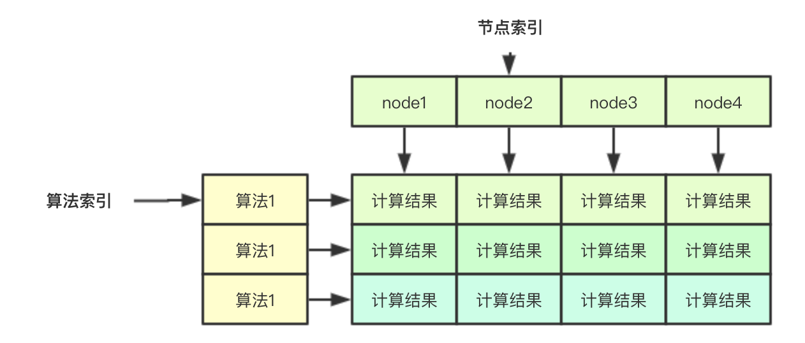
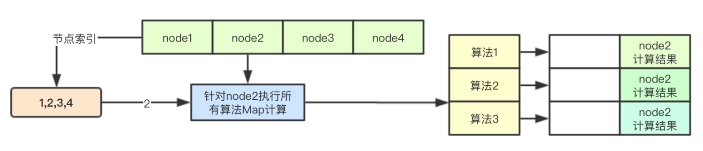
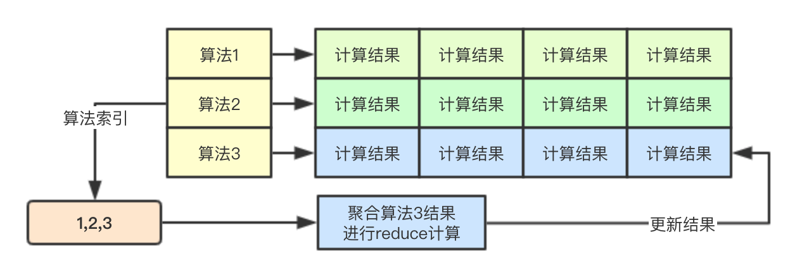

# 基于map/reduce无锁设计的优选设计实现

优选阶段通过分离计算对象来实现多个node和多种算法的并行计算，并且通过基于二级索引来设计最终的存储结果，从而达到整个计算过程中的无锁设计，同时为了保证分配的随机性，针对同等优先级的采用了随机的方式来进行最终节点的分配，如果大家后续有类似的需求，不妨可以借鉴借鉴

<!--more-->

# 1. 设计基础


## 1.1 两阶段: 单点与聚合

在进行优选的时候，除了最后一次计算，在进行针对单个算法的计算的时候，会分为两个阶段：单点和聚合


在单点阶段，会根据当前算法针对单个node计算

在聚合阶段，则会根据当前单点阶段计算完成后，来进行聚合


## 1.2 并行: 节点与算法

单点和聚合两阶段在计算的时候，都是并行的，但是对象则不同，其中单点阶段并行是针对单个node的计算，而聚合阶段则是针对算法级别的计算，通过这种设计分离计算，从而避免多goroutine之间数据竞争，无锁加速优选的计算

## 1.3 map与reduce

而map与reduce则是针对一个上面并行的两种具体实现，其中map中负责单node打分，而reduce则是针对map阶段的打分进行聚合后，根据汇总的结果进行二次打分计算


## 1.4 weight

map/reduce阶段都是通过算法计算，如果我们要进行自定义的调整，针对单个算法，我们可以调整其在预选流程中的权重，从而进行定制自己的预选流程 


## 1.5 随机分布

当进行优先级判断的时候，肯定会出现多个node优先级相同的情况，在优选节点的时候，会进行随机计算，从而决定是否用当前优先级相同的node替换之前的最合适的node


# 2. 源码分析 

优选的核心流程主要是在PrioritizeNodes中，这里只介绍其关键的核心数据结构设计

## 2.1 无锁计算结果保存

无锁计算结果的保存主要是通过下面的二维数组实现， 如果要存储一个算法针对某个node的结果，其实只需要通过两个索引即可：算法索引和节点索引，同理如果我吧针对单个node的索引分配给一个goroutine，则其去其他的goroutine则就可以并行计算



```
// 在计算的时候，会传入nodes []*v1.Node的数组，存储所有的节点，节点索引主要是指的该部分
results := make([]schedulerapi.HostPriorityList, len(priorityConfigs), len(priorityConfigs))
```


## 2.2 基于节点索引的Map计算



之前在预选阶段介绍过ParallelizeUntil函数的实现，其根据传入的数量来生成计算索引，放入chan中，后续多个goroutine从chan中取出数据直接进行计算即可

```
    workqueue.ParallelizeUntil(context.TODO(), 16, len(nodes), func(index int) {
        // 根据节点和配置的算法进行计算
        nodeInfo := nodeNameToInfo[nodes[index].Name]
            // 获取算法的索引
        for i := range priorityConfigs {
            if priorityConfigs[i].Function != nil {
                continue
            }

            var err error
                
                // 通过节点索引，来进行针对单个node的计算结果的保存
            results[i][index], err = priorityConfigs[i].Map(pod, meta, nodeInfo)
            if err != nil {
                appendError(err)
                results[i][index].Host = nodes[index].Name
            }
        }
    })
```

## 2.3 基于算法索引的Reduce计算



基于算法的并行，则是为每个算法的计算都启动一个goroutine,每个goroutine通过算法索引来进行该算法的所有map阶段的结果的读取，并进行计算，后续结果仍然存储在对应的位置

```
    // 计算策略的分值
    for i := range priorityConfigs {
        if priorityConfigs[i].Reduce == nil {
            continue
        }
        wg.Add(1)
        go func(index int) {
            defer wg.Done()
            if err := priorityConfigs[index].Reduce(pod, meta, nodeNameToInfo, results[index]); err != nil {
                appendError(err)
            }
            if klog.V(10) {
                for _, hostPriority := range results[index] {
                    klog.Infof("%v -> %v: %v, Score: (%d)", util.GetPodFullName(pod), hostPriority.Host, priorityConfigs[index].Name, hostPriority.Score)
                }
            }
        }(i)
    }
    // Wait for all computations to be finished.
    wg.Wait()
```

## 2.4 优先级打分结果统计

根据之前的map/reduce阶段，接下来就是将针对所有node的所有算法计算结果进行累加即可

```
    // Summarize all scores.
    result := make(schedulerapi.HostPriorityList, 0, len(nodes))

    for i := range nodes {
        result = append(result, schedulerapi.HostPriority{Host: nodes[i].Name, Score: 0})
        // 便利所有的算法配置
        for j := range priorityConfigs {
            result[i].Score += results[j][i].Score * priorityConfigs[j].Weight
        }

        for j := range scoresMap {
            result[i].Score += scoresMap[j][i].Score
        }
    }
```

## 2.5 根据优先级随机筛选host

这里的随机筛选是指的当多个host优先级相同的时候，会有一定的概率用当前的node替换之前的优先级相等的node(到目前为止的优先级最高的node), 其主要通过cntOfMaxScore和rand.Intn(cntOfMaxScore)来进行实现

```
func (g *genericScheduler) selectHost(priorityList schedulerapi.HostPriorityList) (string, error) {
    if len(priorityList) == 0 {
        return "", fmt.Errorf("empty priorityList")
    }
    maxScore := priorityList[0].Score
    selected := priorityList[0].Host
    cntOfMaxScore := 1
    for _, hp := range priorityList[1:] {
        if hp.Score > maxScore {
            maxScore = hp.Score
            selected = hp.Host
            cntOfMaxScore = 1
        } else if hp.Score == maxScore {
            cntOfMaxScore++
            if rand.Intn(cntOfMaxScore) == 0 {
                // Replace the candidate with probability of 1/cntOfMaxScore
                selected = hp.Host
            }
        }
    }
    return selected, nil
}
```


# 3. 设计总结

优选阶段通过分离计算对象来实现多个node和多种算法的并行计算，并且通过基于二级索引来设计最终的存储结果，从而达到整个计算过程中的无锁设计，同时为了保证分配的随机性，针对同等优先级的采用了随机的方式来进行最终节点的分配，如果大家后续有类似的需求，不妨可以借鉴借鉴