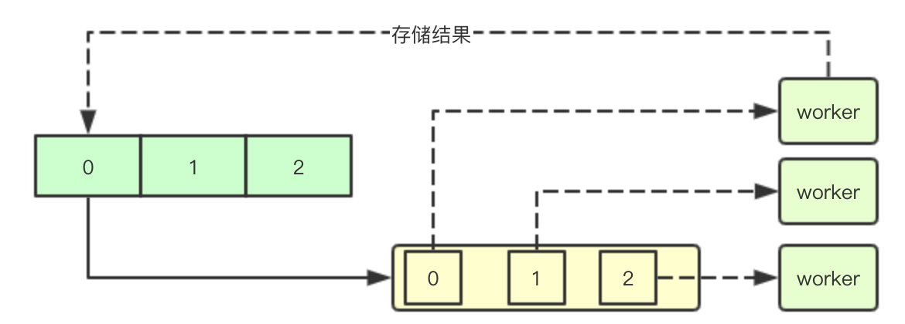
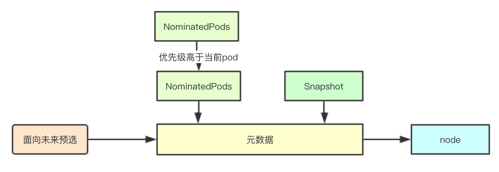
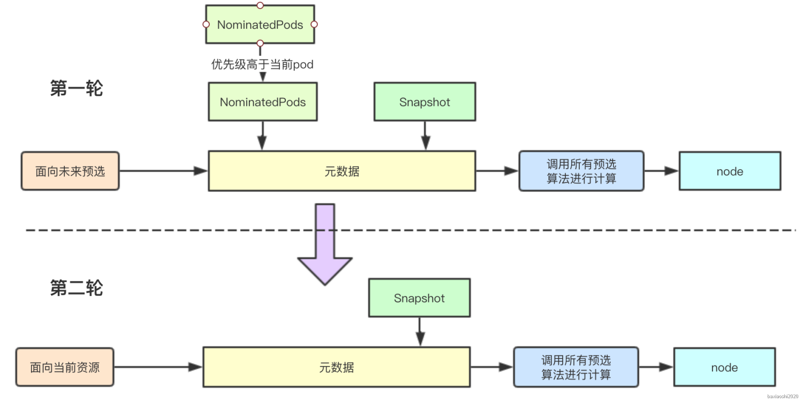

# 基于并行筛选的预选设计设计实现

# 1. 基础设计


## 1.1 预选场景

预选顾名思义就是从当前集群中的所有的node中，选择出满足当前pod资源和亲和性等需求的node节点，如何在集群中快速选择这样的节点，是个复杂的问题

<!--more-->

## 1.2 平均分布

平均分布主要是通过让一个分配索引来进行即只有当所有的node都在本轮分配周期内分配一次后，才开始从头进行分配，从而保证集群的平均分布


## 1.3 预选中断

预选终端即在预选的过程中如果发现node已经不能满足当前pod资源需求的时候，就进行中断预选流程，尝试下一个节点


## 1.4 并行筛选

在当前k8s版本中，默认会启动16个goroutine来进行并行的预选，从而提高性能,从而提高预选的性能


## 1.5 局部最优解

预选流程需要从当前集群中选择一台符合要求的node随着集群规模的增长，如果每次遍历所有集群node则会必然导致性能的下降，于是通过局部最优解的方式，缩小筛选节点的数量


# 2. 源码分析 

预选的核心流程是通过findNodesThatFit来完成，其返回预选结果供优选流程使用

## 2.1 取样逻辑

取样是通过当前集群中的node数量和默认的最小值来决定本次预选阶段需要获取的node节点数量

```
        // 获取所有的节点数量，并通过计算百分比，获取本次选举选择的节点数量
        allNodes := int32(g.cache.NodeTree().NumNodes())
        // 确定要查找node数量
        numNodesToFind := g.numFeasibleNodesToFind(allNodes)
```

## 2.2 取样算法

取样算法很简单从集群中获取指定百分比的节点默认是50%，如果50%的节点数量小于minFeasibleNodesToFind则按照minFeasibleNodesToFind(最小取样节点数量)来取样，

```
func (g *genericScheduler) numFeasibleNodesToFind(numAllNodes int32) (numNodes int32) {
    // 如果当前节点数量小于minFeasibleNodesToFind即小于100台node
    // 同理百分比如果大于100就是全量取样
    // 这两种情况都直接遍历整个集群中所有节点
    if numAllNodes < minFeasibleNodesToFind || g.percentageOfNodesToScore >= 100 {
        return numAllNodes
    }

    adaptivePercentage := g.percentageOfNodesToScore
    if adaptivePercentage <= 0 {
        adaptivePercentage = schedulerapi.DefaultPercentageOfNodesToScore - numAllNodes/125
        if adaptivePercentage < minFeasibleNodesPercentageToFind {
            adaptivePercentage = minFeasibleNodesPercentageToFind
        }
    }

    // 正常取样计算：比如numAllNodes为5000，而adaptivePercentage为50%
    // 则numNodes=50000*0.5/100=250
    numNodes = numAllNodes * adaptivePercentage / 100
    if numNodes < minFeasibleNodesToFind { // 如果小于最少取样则按照最少取样进行取样
        return minFeasibleNodesToFind
    }

    return numNodes
}
```

## 2.3 取样元数据准备

通过filtered来进行预选结果的存储，通过filteredLen来进行原子保护协作多个取样goroutine, 并通过predicateMetaProducer和当前的snapshot来进行元数据构建

```
        filtered = make([]*v1.Node, numNodesToFind)
        errs := errors.MessageCountMap{}
        var (
            predicateResultLock sync.Mutex
            filteredLen         int32
        )

        ctx, cancel := context.WithCancel(context.Background())

        // We can use the same metadata producer for all nodes.
        meta := g.predicateMetaProducer(pod, g.nodeInfoSnapshot.NodeInfoMap)
```

## 2.4 通过channel协作并行取样

并行取样主要通过调用下面的函数来启动16个goroutine来进行并行取样，并通过ctx来协调退出

```
workqueue.ParallelizeUntil(ctx, 16, int(allNodes), checkNode)
```



通过channel来构建取样索引的管道，每个worker会负责从channel获取的指定索引取样node的填充

```
func ParallelizeUntil(ctx context.Context, workers, pieces int, doWorkPiece DoWorkPieceFunc) {
    var stop <-chan struct{}
    if ctx != nil {
        stop = ctx.Done()
    }

    // 生成指定数量索引，worker通过索引来进行预选成功节点的存储
    toProcess := make(chan int, pieces)
    for i := 0; i < pieces; i++ {
        toProcess <- i
    }
    close(toProcess)

    if pieces < workers {
        workers = pieces
    }

    wg := sync.WaitGroup{}
    wg.Add(workers)
    for i := 0; i < workers; i++ {
        // 启动多个goroutine
        go func() {
            defer utilruntime.HandleCrash()
            defer wg.Done()
            for piece := range toProcess {
                select {
                case <-stop:
                    return
                default:
                    //获取索引，后续会通过该索引来进行结果的存储
                    doWorkPiece(piece)
                }
            }
        }()
    }
    // 等待退出
    wg.Wait()
}
```

## 2.5 取样并行函数

```
        checkNode := func(i int) {
            // 获取一个节点
            nodeName := g.cache.NodeTree().Next()

            // 取样核心流程是通过podFitsOnNode来确定
            fits, failedPredicates, status, err := g.podFitsOnNode(
                pluginContext,
                pod,
                meta,
                g.nodeInfoSnapshot.NodeInfoMap[nodeName],
                g.predicates, // 传递预选算法
                g.schedulingQueue,
                g.alwaysCheckAllPredicates,
            )
            if err != nil {
                predicateResultLock.Lock()
                errs[err.Error()]++
                predicateResultLock.Unlock()
                return
            }
            if fits {
                // 如果当前以及查找到的数量大于预选的数量，就退出
                length := atomic.AddInt32(&filteredLen, 1)
                if length > numNodesToFind {
                    cancel()
                    atomic.AddInt32(&filteredLen, -1)
                } else {
                    filtered[length-1] = g.nodeInfoSnapshot.NodeInfoMap[nodeName].Node()
                }
            } else {
                // 进行错误状态的保存 
                predicateResultLock.Lock()
                if !status.IsSuccess() {
                    filteredNodesStatuses[nodeName] = status
                }
                if len(failedPredicates) != 0 {
                    failedPredicateMap[nodeName] = failedPredicates
                }
                predicateResultLock.Unlock()
            }
        }
```

## 2.6 面向未来的筛选



在kubernetes中经过调度器调度后的pod结果会放入到SchedulingQueue中进行暂存，这些pod未来可能会经过后续调度流程运行在提议的node上，也可能因为某些原因导致最终没有运行，而预选流程为了减少后续因为调度冲突(比如pod之间的亲和性等问题，并且当前pod不能抢占这些pod)，则会在进行预选的时候，将这部分pod考虑进去


如果在这些pod存在的情况下，node可以满足当前pod的筛选条件，则可以去除被提议的pod再进行筛选(如果这些提议的pod最终没有调度到node,则当前node也需要满足各种亲和性的需求)


## 2.6 取样核心设计



结合上面说的面向未来的筛选，通过两轮筛选在无论那些优先级高的pod是否被调度到当前node上，都可以满足pod的调度需求，在调度的流程中只需要获取之前注册的调度算法，完成预选检测，如果发现有条件不通过则不会进行第二轮筛选，继续选择下一个节点

```
func (g *genericScheduler) podFitsOnNode(
    pluginContext *framework.PluginContext,
    pod *v1.Pod,
    meta predicates.PredicateMetadata,
    info *schedulernodeinfo.NodeInfo,
    predicateFuncs map[string]predicates.FitPredicate,
    queue internalqueue.SchedulingQueue,
    alwaysCheckAllPredicates bool,
) (bool, []predicates.PredicateFailureReason, *framework.Status, error) {
    var failedPredicates []predicates.PredicateFailureReason
    var status *framework.Status

    // podsAdded主要用于标识当前是否有提议的pod如果没有提议的pod则就不需要再进行一轮筛选了
    podsAdded := false
    
    for i := 0; i < 2; i++ {
        metaToUse := meta
        nodeInfoToUse := info
        if i == 0 {
            // 首先获取那些提议的pod进行第一轮筛选, 如果第一轮筛选出错，则不会进行第二轮筛选
            podsAdded, metaToUse, nodeInfoToUse = addNominatedPods(pod, meta, info, queue)
        } else if !podsAdded || len(failedPredicates) != 0 {
            // 如果
            break
        }
        for _, predicateKey := range predicates.Ordering() {
            var (
                fit     bool
                reasons []predicates.PredicateFailureReason
                err     error
            )
            //TODO (yastij) : compute average predicate restrictiveness to export it as Prometheus metric
            if predicate, exist := predicateFuncs[predicateKey]; exist {
                // 预选算法计算
                fit, reasons, err = predicate(pod, metaToUse, nodeInfoToUse)
                if err != nil {
                    return false, []predicates.PredicateFailureReason{}, nil, err
                }

                if !fit {
                    // eCache is available and valid, and predicates result is unfit, record the fail reasons
                    failedPredicates = append(failedPredicates, reasons...)
                    // if alwaysCheckAllPredicates is false, short circuit all predicates when one predicate fails.
                    if !alwaysCheckAllPredicates {
                        klog.V(5).Infoln("since alwaysCheckAllPredicates has not been set, the predicate " +
                            "evaluation is short circuited and there are chances " +
                            "of other predicates failing as well.")
                        break
                    }
                }
            }
        }

        status = g.framework.RunFilterPlugins(pluginContext, pod, info.Node().Name)
        if !status.IsSuccess() && !status.IsUnschedulable() {
            return false, failedPredicates, status, status.AsError()
        }
    }

    return len(failedPredicates) == 0 && status.IsSuccess(), failedPredicates, status, nil
}
```


# 参考资料

美团早期针对k8s调度的一些优化

<https://tech.meituan.com/2019/08/22/kubernetes-cluster-management-practice.html>