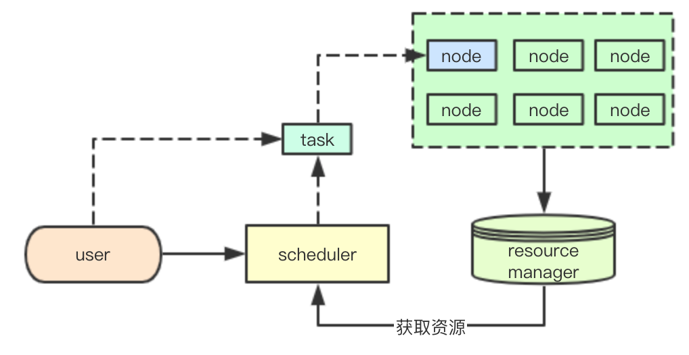
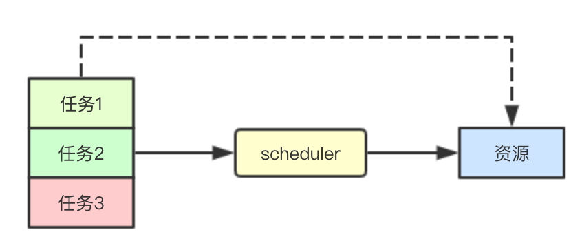
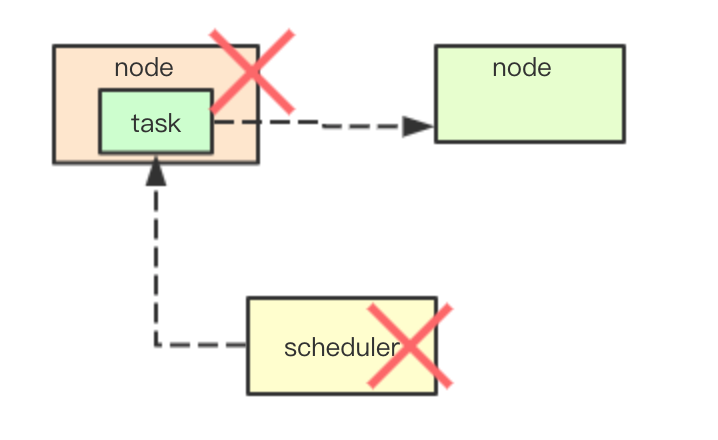
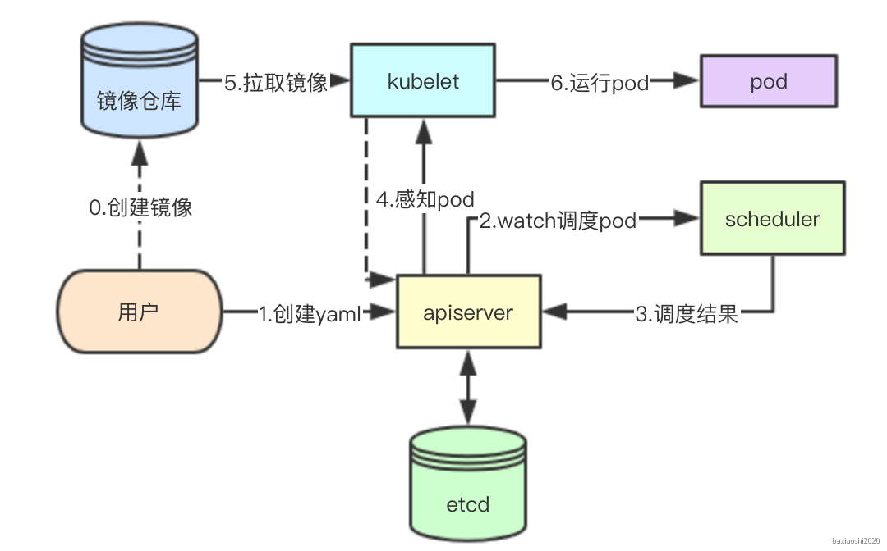
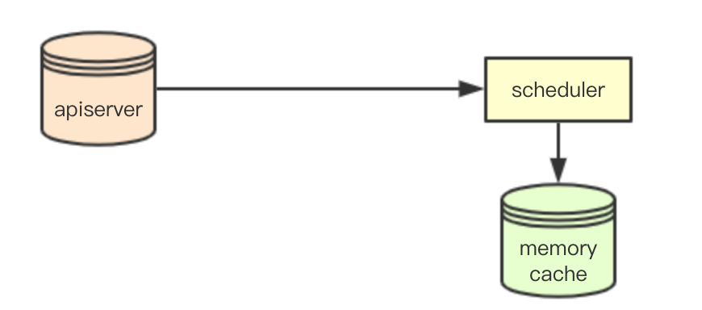
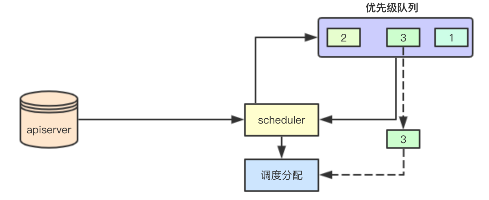
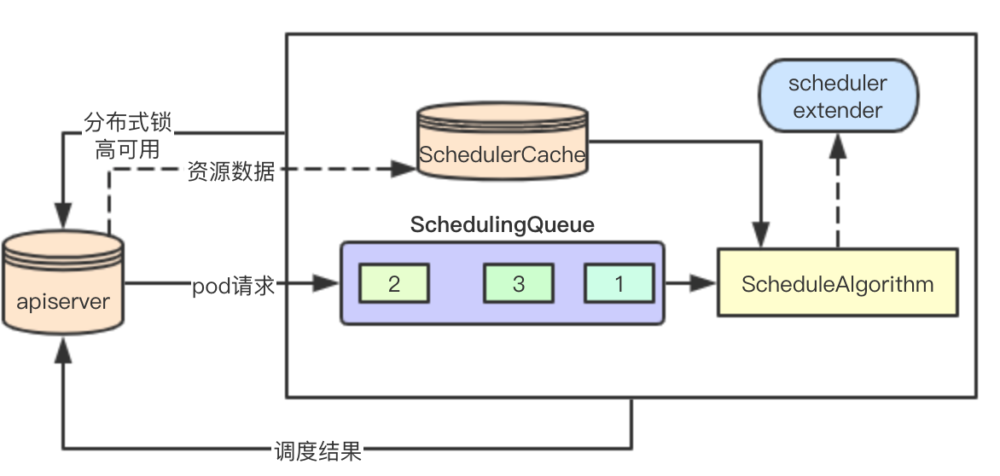

# 调度器学习基础概览

# 1. 资源调度基础

scheudler是kubernetes中的核心组件，负责为用户声明的pod资源选择合适的node,同时保证集群资源的最大化利用，这里先介绍下资源调度系统设计里面的一些基础概念

<!--more-->

## 1.1 基础任务资源调度

基础的任务资源调度通常包括三部分：

| 角色类型         | 功能                                                         |
| ---------------- | ------------------------------------------------------------ |
| node             | node负责具体任务的执行,同时对包汇报自己拥有的资源            |
| resource manager | 汇总当前集群中所有node提供的资源,供上层的scheduler的调用获取,同时根据node汇报的任务信息来进行当前集群资源的更新 |
| scheduler        | 结合当前集群的资源和用户提交的任务信息,选择合适的node节点当前的资源，分配节点任务，尽可能保证任务的运行 |

通用的调度框架往往还会包含一个上层的集群管理器，负责针对集群中scheduler的管理和资源分配工作，同时负责scheduler集群状态甚至resource manager的保存

## 1.2 资源调度设计的挑战

### 1.2.1 资源：集群资源利用的最大化与平均

传统的IDC集群资源利用：

在IDC环境中我们通常希望机器利用率能够平均,让机器保持在某个平均利用率，然后根据资源的需要预留足够的buffer, 来应对集群的资源利用高峰，毕竟采购通常都有周期，我们既不能让机器空着，也不能让他跑满(业务无法弹性)

云环境下的资源利用：

而云环境下我们可以按需分配，而且云厂商通常都支持秒级交付，那其实下面的这种资源利用率其实也可以

可以看到仅仅是环境的不一致，就可能会导致不同的调度结果，所有针对集群资源利用最大化这个目标，其实会有很多的不同

### 1.2.2 调度: 任务最少等待时间与优先级

在集群任务繁忙的时候，可能会导致集群资源部足以分配给当前集群中的所有任务，在让所有任务都能够尽快完成的同时，我们还要保证高优先级的任务优先被完成

### 1.2.3 调度: 任务本地性

本地性是指在大数据处理中常用的一种机制，其核心是尽可能将任务分配到包含其任务执行资源的节点上，避免数据的复制

### 1.2.4 集群: 高可用性

在调度过程中可能由于硬件、系统或者软件导致任务的不可用，通常会由需要一些高可用机制，来保证当前集群不会因为部分节点宕机而导致整个系统不可用

### 1.2.5 系统: 可扩展性

扩展机制主要是指的，系统如何如何应对业务需求的变化，提供的一种可扩展机制，在集群默认调度策略不满足业务需求时，通过扩展接口，来进行系统的扩展满足业务需求

## 1.3 Pod调度场景的挑战

Pod调度场景其实可以看做一类特殊的任务，除了上面资源调度的挑战，还有一些针对pod调度这个具体的场景(有些是共同的,这里通过pod来描述会比较清晰)

### 1.3.1 亲和与反亲和

在kubernetes中的亲和性主要体现pod和node两种资源，主要体现在两个方面:

1.亲和性: 1)pod之间的亲和性 2)pod与node之间的亲和性

2.反亲和: 1)pod之间的反亲和性  2)pod与node之间的反亲和

简单举例：

1.pod之间的反亲和: 为了保证高可用我们通常会将同一业务的多个节点分散在不通的数据中心和机架

2.pod与node亲和性: 比如某些需要磁盘io操作的pod，我们可以调度到具有ssd的机器上，提高IO性能

### 1.3.2 多租户与容量规划

多租户通常是为了进行集群资源的隔离，在业务系统中，通常会按照业务线来进行资源的隔离，同时会给业务设定对应的容量，从而避免单个业务线资源的过度使用影响整个公司的所有业务

### 1.3.3 Zone与node选择

zone通常是在业务容灾中常见的概念，通过将服务分散在多个数据中心，避免因为单个数据中心故障导致业务完全不可用

因为之前亲和性的问题，如何在多个zone中的所有node中选择出一个合适的节点，则是一个比较大的挑战

### 1.3.4 多样化资源的扩展

系统资源除了cpu、内存还包括网络、磁盘io、gpu等等，针对其余资源的分配调度，kubernetes还需要提供额外的扩展机制来进行调度扩展的支持

### 1.3.5 资源混部

kubernetes初期是针对pod调度场景而生，主要其实是在线web业务，这类任务的特点大部分都是无状态的，那如何针对离线场景的去支持离线的批处理计算等任务

# 2. kubernetes中的调度初识

## 2.1 中心化数据集中存储

### 2.1.1 中心化的数据存储

kubernetes是一个数据中心化存储的系统，集群中的所有数据都通过apiserver存储到etcd中，包括node节点的资源信息、节点上面的pod信息、当前集群的所有pod信息，在这里其实apiserver也充当了resource manager的角色，存储所有的集群资源和已经分配的资源

### 2.1.2 调度数据的存储与获取

kubernetes中采用了一种list watch的机制，用于集群中其他节点从apiserver感知数据，scheduler也采用该机制，通过在感知apiserver的数据变化，同时在本地memory中构建一份cache数据(资源数据)，来提供调度使用，即SchedulerCache

### 2.1.3 scheduler的高可用

大多数系统的高可用机制都是通过类似zookeeper、etcd等AP系统实现，通过临时节点或者锁机制机制来实现多个节点的竞争，从而在主节点宕机时，能够快速接管， scheduler自然也是这种机制，通过apiserver底层的etcd来实现锁的竞争，然后通过apiserver的数据，就可以保证调度器的高可用

## 2.2 调度器内部组成

### 2.2.1 调度队列

当从apiserver感知到要调度的pod的时候,scheduler会根据pod的优先级，来讲其加入到内部的一个优先级队列中，后续调度的时候，会先获取优先级比较高的pod来进行优先满足调度

这里还有一个点就是如果优先调度了优先级比较低的pod，其实在后续的抢占过程中，也会被驱逐出去

### 2.2.2 调度与抢占调度

前面提到过抢占,kubernetes默认会对所有的pod来尝试进行调度，当集群资源部满足的时候，则会尝试抢占调度，通过抢占调度，为高优先级的pod来进行优先调度 其核心都是通过调度算法实现即ScheduleAlgorithm

这里的调度算法实际上是一堆调度算法和调度配置的集合

### 2.2.3 外部扩展机制

scheduler extender是k8s对调度器的一种扩展机制，我们可以定义对应的extender,在对应资源的调度的时候，k8s会检查对应的资源，如果发现需要调用外部的extender,则将当前的调度数据发送给extender,然后汇总调度数据，决定最终的调度结果

### 2.2.4 内部扩展机制

上面提到调度算法是一组调度算法和调度配置的集合，kubernetes scheduler framework是则是一个框架声明对应插件的接口，从而支持用户编写自己的plugin,来影响调度决策，个人感觉这并不是一种好的机制，因为要修改代码，或者通过修改kubernetes scheduler启动来进行自定义插件的加载

## 2.3 调度基础架构

结合上面所说的就得到了一个最简单的架构，主要调度流程分为如下几部分：

0.通过apiserver来进行主节点选举，成功者进行调度业务流程处理

1.通过apiserver感知集群的资源数据和pod数据，更新本地schedulerCache

2.通过apiserver感知用户或者controller的pod调度请求，加入本地调度队列

3.通过调度算法来进行pod请求的调度，分配合适的node节点，此过程可能会发生抢占调度

4.将调度结果返回给apiserver,然后由kubelet组件进行后续pod的请求处理