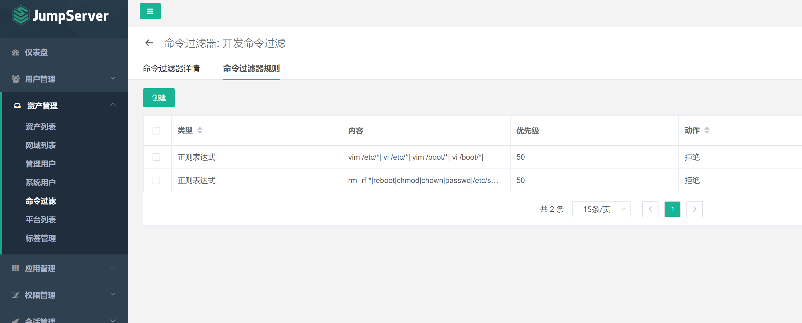

# sudo找不到环境变量的问题

## 原因

sudo命令会重置环境变量,查看文件/etc/sudoers,可以看到这样的配置
Defaults      env_reset

<!--more-->

## 解决方法

**第一种**,也是最简单的，使用sudo -E来代替sudo即可保留当前用户的环境变量，但缺点也很明显，每次都要加

**第二种方式**：修改/etc/sudoers文件，将`Defaults env_reset`改为 `Defaults !env_reset`，这样以后使用sudo就再也不会重置环境变量了

需要注意的是`/etc/sudoers`是只读文件,vim不能更改,要使用`visudo`命令(不用加文件名)来更改内容

不过大部分环境变量我们一般都用不着，这种情况就可以在配置中添加env_keep，来使指定的几个环境变量保持不变

具体的做法是在 `/etc/sudoers`中添加语句 `Defaults env_keep += "env1 env2"` 

这样环境变量env1 和env2就可以在sudo执行时保留原来的值不过既然/etc/sudoers是个只读文件,就不是用来让我们改来改去的；

还除了它，我们还可以在目录`/etc/sudoers.d/`下随便创建文件，写入 Defaults env_keep += "env1 env2"，效果和在/etc/sudoers中是一样的，也更加方便删除和修改

# 常用linux文件权限

444 r--r--r--
600 rw-------
644 rw-r--r--
666 rw-rw-rw-
700 rwx------
744 rwxr--r--
755 rwxr-xr-x
777 rwxrwxrwx

低权限用户要想tab键可以用，上级目录必须拥有x权限

# 跳板机sudo模板

管理多个管理员可以使用sudo模板(ALL)+命令过滤

```sh
ALL,!/bin/bash,!/bin/tcsh,!/bin/su,!/usr/bin/passwd,!/usr/bin/passwd root,!/bin/vim /etc/sudoers,!/usr/bin/vim /etc/sudoers,!/usr/sbin/visudo,!/usr/bin/sudo -i,!/bin/bi /etc/ssh/*,!/bin/chmod 777 /etc/*,!/bin/chmod 777 *,!/bin/chmod 777,!/bin/chmod -R 777 *,!/bin/rm /*,!/bin/rm /,!/bin/rm -rf /,!/bin/rm -rf /*,!/bin/rm /etc,!/bin/rm -r /etc,!/bin/rm -rf /etc,!/bin/rm /etc/*,!/bin/rm -r /etc/*,!/bin/rm -rf /etc/*,!/bin/rm /root,!/bin/rm -r /root,!/bin/rm -rf /root,!/bin/rm /root/*,!/bin/rm -r /root/*,!/bin/rm -rf /root/*,!/bin/rm /bin,!/bin/rm -r /bin,!/bin/rm -rf /bin,!/bin/rm /bin/*,!/bin/rm -r /bin/*,!/bin/rm -rf /bin/*
```

## 命令过滤



```sh
vim /etc/*|
vi /etc/*|
vim /boot/*|
vi /boot/*|
rm -rf *|
reboot|
chmod|
chown|
passwd|
/etc/sudoers|
/usr/sbin/visudo|
bi|
ssh|
etc|
待更新...
```

